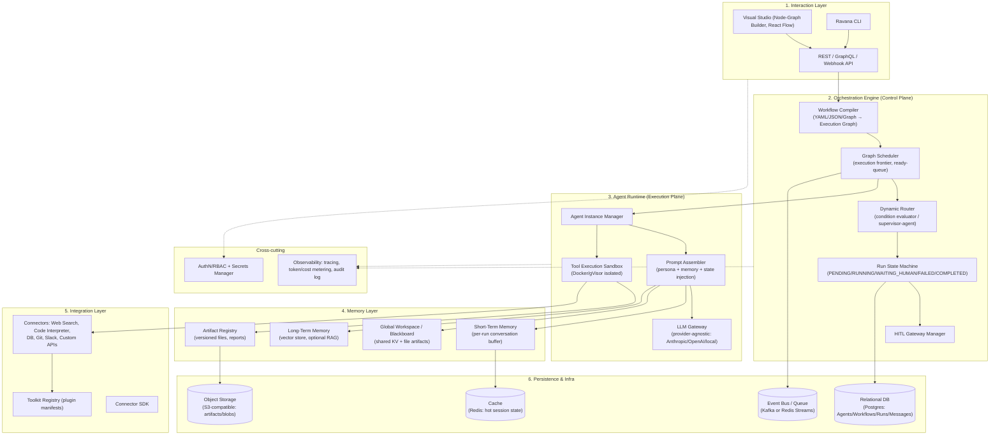
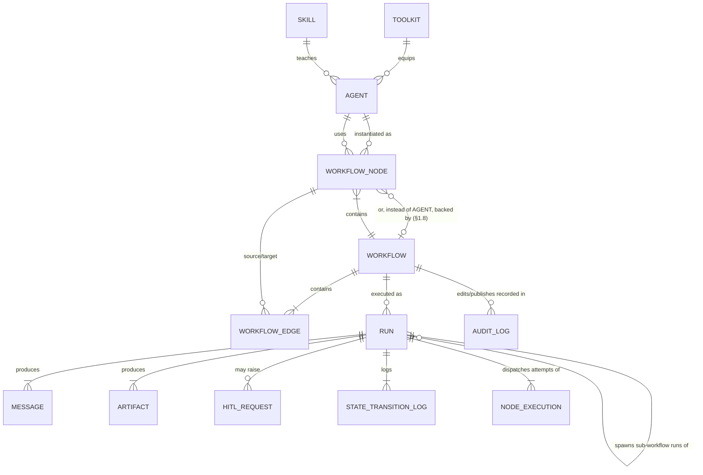
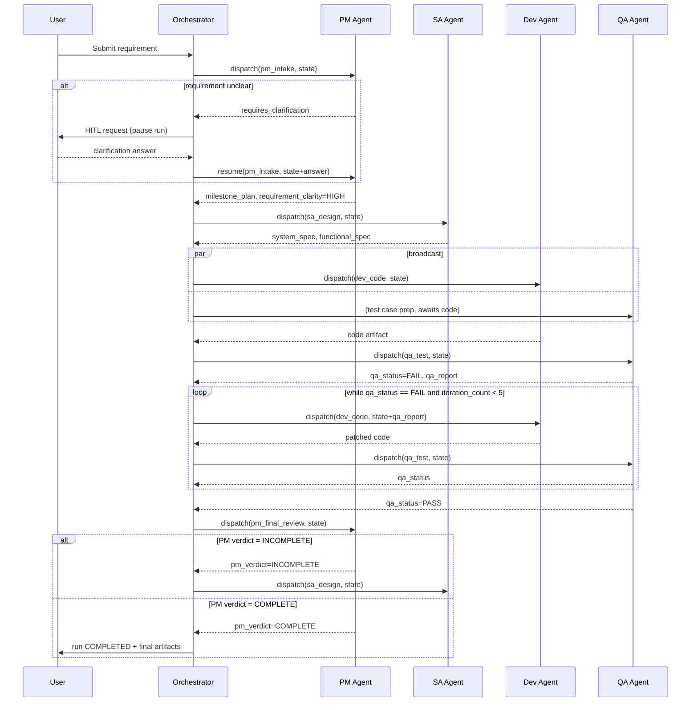
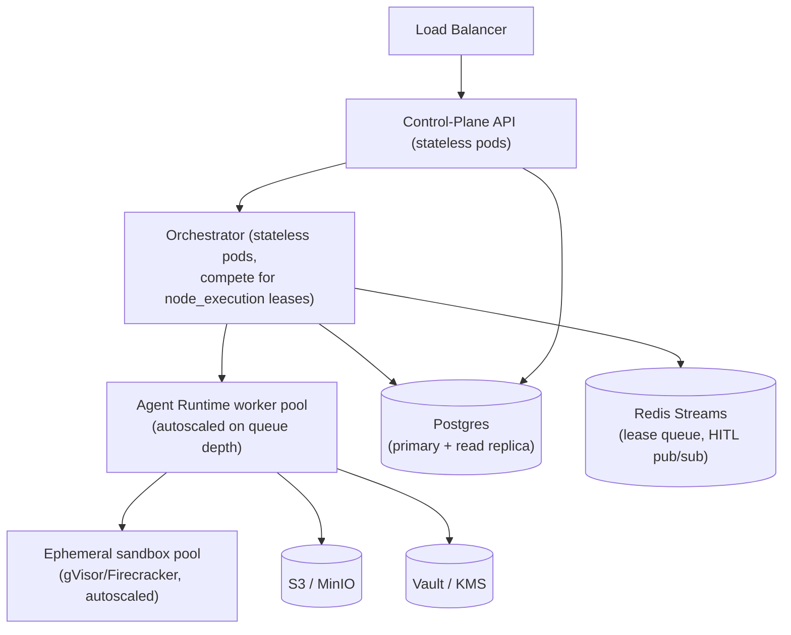

# Ravana — System Design Document

**Domain-agnostic Multi-Agent Orchestration Framework**
Version: 0.16 (Draft) · Author: Principal Architecture Draft · Date: 2026-07-07

> **v0.2 changelog:** v0.1 covered the conceptual architecture (layers, data model, execution flow, sample config). v0.2 adds what's needed to actually build it: the node execution contract, concurrency/idempotency semantics, a recommended tech stack, the external API contract, the security/isolation model, platform-level reliability, deployment topology, an evaluation strategy for non-deterministic agents, and a phased implementation roadmap.
>
> **v0.3 changelog:** resolves the two highest-risk open decisions flagged in v0.2 into firm calls (with reasoning) instead of open options — §3.4 now ranks structured-output strategies by reliability per provider capability instead of treating them as interchangeable, and §8 makes an explicit buy-vs-build call on sandbox isolation (managed provider first, self-host only if forced).
>
> **v0.4 changelog:** §6 collapses the earlier Go/Python/TypeScript backend split into a single-language recommendation (Python everywhere except the unavoidably-browser-based Visual Studio UI) — the polyglot split wasn't earning its complexity cost for an I/O-bound workload at this stage.
>
> **v0.5 changelog:** adds §1.5 UI Surfaces — the "Interaction Layer" box in §1.1 was one label hiding three distinct jobs (workflow authoring, starting a run, operating/HITL) with no design for the latter two; this pins them down as one web app with two areas plus the CLI, and corrects the Phase 1 roadmap line accordingly.
>
> **v0.6 changelog:** §9 previously named "token/cost metering" as a cross-cutting concern without defining any actual metric; adds a concrete Key Metrics & Dashboards subsection (product, reliability, cost tiers) and backs it with new `node_execution` columns (`repair_count`, `tool_call_count`, token/cost) so the metrics are queryable directly instead of requiring a message-table scan.
>
> **v0.7 changelog:** §8 referenced an `audit_log` table by name for two versions without it ever being defined in §2.2 — it's now a real table (actor, action, entity, before/after diff), `workflow` gains an explicit `DRAFT`/`PUBLISHED`/`ARCHIVED` `status` (replacing the boolean `is_published`) plus `created_by`/`published_by`/`published_at`, and §1.5's Design area gets a version-history tab backed by it.
>
> **v0.8 changelog:** adds a Runtime Logging & Correlation subsection to §9 — the domain execution log (`message`/`state_transition_log`/`node_execution`) was already fully specified, but the separate infrastructure/application log layer (Loki, named in §6's stack table since v0.2) had no log-level policy, no retention policy, and critically no correlation key tying it back to a `run_id`/`node_execution_id` — without that key the two log layers were two disconnected debugging dead-ends.
>
> **v0.9 changelog:** every prior version silently assumed one centrally-hosted deployment shape; §10 is now Installation & Deployment Modes with four tiers (Local/Embedded, self-hosted single-instance, self-hosted scaled, Managed Cloud), because Ravana's own running example needs real filesystem access to a project — "install onto a project path" is a distinct architecture (SQLite, no lease/CAS, host-run `code_interpreter`), not a lighter version of the hosted one. §12's roadmap is reordered to build the Local/Embedded tier first rather than implicitly assuming Postgres from Phase 0.
>
> **v0.10 changelog:** corrects a real flaw introduced in v0.9 — §10.1 said the workspace *is* the project directory, with `code_interpreter` mounting it read-write, which directly contradicts not impacting the developer's source. Agents now operate on an isolated `git clone --local` (or opt-in `git worktree`) per run, on its own branch, with the sandbox mount scoped to only that clone; handoff back to the real project is a PR/patch, never an auto-merge — local execution stays the right call, only what it's allowed to touch changes.
>
> **v0.11 changelog:** adds §1.6 Skills — a new primitive distinct from Toolkits, for attaching reusable procedural knowledge (commit conventions, security checklists, brand-voice guides) to an agent without duplicating prose across `system_prompt`s or bloating context. Ships as static always-on injection first; progressive-disclosure loading via the existing §3.4 tool-use loop is explicitly deferred until context bloat is a measured problem, not assumed upfront. New `skill` table (§2.2), `agent.skill_ids`, and a worked example (`conventional_commits`, `secure_coding_checklist` on the Dev agent) in §4. Also fixes `toolkit` missing `org_id`, an inconsistency left over from when multi-tenancy was added in v0.2.
>
> **v0.12 changelog:** adds §1.7 MCP Servers — no new schema, just a new `toolkit.type = 'mcp_server'` value, since an MCP server is already shaped exactly like the existing Toolkit primitive (§2.2). This makes MCP the default path for third-party integrations (GitHub, Slack, Postgres, ...) and the bespoke Connector SDK (§1.2) the fallback for anything not already published as an MCP server — flips the assumption that every integration needs custom connector code. Extends §8's prompt-injection bullet with the MCP-specific "tool poisoning" risk (a remote server's tool list can change after approval) and the resulting requirement that `mcp_server` Toolkits come from an admin-curated allow-list. Sample YAML (§4) gets a concrete `github_mcp` toolkit on the SA agent alongside the existing hand-rolled `git_connector` on Dev, showing both patterns side by side.
>
> **v0.13 changelog:** a full gap-review pass, all 9 findings incorporated. Two correctness fixes: §3.1's engine loop previously left "zero edges matched" undefined when it wasn't a terminal node — now HITL is checked before a `workflow_edge.is_default` catch-all, before a hard fail-fast (`ravana validate`, §7, now warns on missing safety nets); fixing this exposed a genuine dead end already present in §4's own sample workflow (`qa_test` with `FAIL` and `iteration_count >= 5` matched no edge), now fixed with a default edge. New §3.7 adds `workflow.concurrency` groups so two `Run`s of the same workflow can't collide on the same external resource (e.g. both branching the same repo, §10.1) — a gap `state_version`'s CAS (§3.5) never covered since that only protects Ravana's own state, not external systems. `agent.llm_fallback` (§3.6) and `hitl_request.assignee` + defined concurrent-HITL semantics (§3.1) close two "what happens when the primary path fails/who gets asked" gaps. §9 adds per-credential rate limiting (distinct from the existing per-`org_id` backpressure) and separates cost *governance* from *billing*. §8 adds data governance (PII flag on state keys, right-to-delete) and documents content moderation as a composition of existing primitives rather than a new one — both gated to when the Managed Cloud tier actually needs them (§12), not before. New §1.8 adds workflow composition (sub-workflows), deferred to Phase 2 in the roadmap until cross-workflow reuse is an actual, not speculative, need.
>
> **v0.14 changelog:** fixes a real inconsistency found while drafting non-SWE example workflows (`docs/EXAMPLES.md`) — §3.1's Resume step said a HITL answer just "re-runs routing," which contradicts both the PM clarification example (needs the agent to actually reinterpret the human's free-text answer into structured state) and §3.2's own sequence diagram (already showed PM being re-dispatched, not just re-routed). Resume is now correctly defined as dispatching a new `node_execution` attempt for the same node, reusing §3.6's attempt/retry machinery rather than inventing a second mechanism.
>
> **v0.15 changelog:** an external review pass, six findings, all fixed. Two P1s: (1) `idempotency_key = hash(run_id, node_id, attempt)` (§2.2/§3.6) changed on every retry by construction, since a retry *is* a new `attempt` — meaning "connectors dedupe on this key" could never actually catch a duplicate, the exact case it existed for. Replaced with a per-call, content-addressed key (`hash(run_id, node_id, tool_name, canonical_json(arguments))`) computed fresh at every invocation instead of stored on `node_execution`. (2) §12's Phase 0 roadmap row said `code_interpreter` runs "on host," reading as unsandboxed to anyone following the table without cross-referencing §10.1's actual (correct) container-plus-workspace-only-mount design — reworded explicitly. Four P2s: `workflow_node` gets a real `CHECK` for its documented-but-unenforced agent/sub-workflow XOR, `workflow_edge` gets a `source_node_id` FK and a non-empty-targets `CHECK` (array-element FK to `target_node_ids` is acknowledged as a deliberate compiler-enforced gap, not silently assumed); `state_transition_log` gains `sequence`/`node_execution_id`/`event_type`/`state_version_before`/`after` since the "replay reconstructs state" claim had no way to actually back it without them; every YAML example's `auth_ref` moves from nested-in-`config` to the top-level field the DDL always specified; and §12/TASKS.md's Phase 0 splits into **0a** (deterministic graph engine against scripted mock agents — no real LLM/tool/git at all) and **0b** (swap in real providers/tools/git on an engine already proven correct), since the original single "4–6 week MVP" bundled a full vertical platform slice, not an MVP.
>
> **v0.16 changelog:** the first design-vs-implementation reconciliation pass, written after Phase 0a shipped and was reviewed. One real design gap, now closed: the graph had fan-out (broadcast) but no fan-in — §4's own `qa_test` was dispatched once per arriving edge (twice per QA cycle), correct only by accident. New §3.8 adds a per-node **join policy** (`join: any`/`all`) with quiescence firing for cyclic re-entry and log-derived arrivals, and §4's example now declares it. The rest is drift reconciliation, both directions: §3.1 now defines implicit terminals (a node with no outgoing edges — code fixed this first, doc catches up) and states plainly that `dod_criteria` evaluation is design intent not yet implemented (it was parsed and persisted but never evaluated, and no task tracked it — now a 0b item); `on_enter`'s grammar (`state.<key> (=|+=|-=) <expr>`) and the JS-style condition surface syntax are documented instead of living only in the implementation; `run.current_nodes` is flagged as reserved-not-yet-maintained; §3.6 and §3.7 note the 0a limitations (immediate retry instead of backoff; `queue`d runs needing a Phase 1 scheduler tick to unblock).

---

## 0. Design Philosophy → Architectural Consequences

| Philosophy | Consequence for the design |
|---|---|
| Domain agnostic | No hardcoded roles (no `PMAgent` class). Roles are **data** (config rows), not code. The runtime only knows "Agent Definition" + "Node". |
| Engineer-defined topology | The graph (nodes, edges, conditions) is a first-class persisted artifact, compiled from YAML/JSON/visual-graph into an internal execution graph — never hand-coded control flow. |
| Event-driven & state-managed | The engine is built on **durable, event-sourced execution** (append-only log of state transitions + messages), not in-memory orchestration. A crashed worker must be able to resume a `Run` from its last committed step. |
| Loops & conditions | The graph is a **cyclic** directed graph (not a strict DAG like Airflow) — closer to a Petri net / state machine with guarded transitions, similar in spirit to LangGraph or a GroupChat manager, generalized beyond chat. |

---

## 1. System Architecture

### 1.1 Layered View



### 1.2 Component Responsibilities

- **Interaction Layer** — Engineers author workflows visually (node-graph builder, n8n-style) or declaratively (YAML/JSON). Both compile to the same internal graph representation, so the visual editor is just a serializer/deserializer over the same schema described in §4.
- **Orchestration Engine** — The brain. Owns the graph scheduler, the conditional router, the run-level state machine, and the HITL pause/resume mechanism. It never executes agent logic itself — it only decides *what runs next* and *persists why*.
- **Agent Runtime** — The muscle. Ephemeral, stateless workers that are handed `(AgentDefinition, current shared state, node inputs)` and return `(output message, state deltas, artifacts, tool calls)`. Stateless workers mean horizontal scaling and crash-safety: any worker can pick up any node execution.
- **Memory Layer** — Three distinct memory tiers with different lifetimes (see §1.3).
- **Integration Layer** — A plugin architecture so tools are added without touching engine code — a `Toolkit` is a manifest (input/output schema + auth reference) plus an executor registered in the sandbox.
- **Persistence & Infra** — Postgres for structured control-plane data (with JSONB columns for flexible/semi-structured payloads — a hybrid relational/document approach), object storage for large artifacts, an event bus for async fan-out (parallel broadcast nodes), Redis for hot state.

### 1.3 Memory Model (detail)

| Tier | Scope | Backing store | Example content |
|---|---|---|---|
| **Short-term memory** | Per-session/run, per-agent conversational context | Redis / Postgres JSONB | Rolling message history for one agent's turn-taking |
| **Global Workspace (Blackboard)** | Per-run, shared across *all* agents in the run | KV store (Redis/Postgres) + mounted volume | `requirement`, `qa_status`, `iteration_count`, file paths agents read/write |
| **Long-term memory** | Cross-run, cross-workflow (optional) | Vector DB (pgvector/Pinecone) | Past incidents, style guides, org knowledge for RAG |
| **Artifact Registry** | Per-run, versioned, immutable | Object storage + Postgres metadata | Source code, test reports, design docs, diagrams |

The **Global Workspace** is the mechanism that makes the SDLC example work: SA writes `system_spec` into workspace state; Dev and QA both read it without direct agent-to-agent coupling — agents communicate *through state*, not only through direct messages (blackboard pattern), which is what keeps the framework domain-agnostic (a Marketing team's "workspace" might hold `campaign_brief` and `draft_copy` instead).

### 1.4 Per-Agent LLM Backing (Provider-Agnostic Model Routing)

The `llm` block lives on the **Agent Definition**, not on the workflow or the engine — so every agent in a run can be backed by a different provider or model, chosen for what that specific role needs (reasoning depth, cost, latency, data residency, or on-prem/offline requirement). The LLM Gateway (§1.1) resolves this per node dispatch:

| Field | Purpose |
|---|---|
| `llm.provider` | `anthropic` \| `openai` \| `google` \| `local` \| any registered provider adapter |
| `llm.model` | Model identifier within that provider (e.g. `claude-sonnet-5`, `gpt-4o`, `llama-3.1-70b`) |
| `llm.temperature`, `llm.max_tokens` | Standard sampling params |
| `llm.endpoint` *(optional)* | Overrides the provider's default API base URL — this is what points an agent at a **self-hosted / local runtime** (Ollama, vLLM, LM Studio, TGI, or an internal inference gateway) instead of a cloud API |
| `llm.api_key_ref` *(optional)* | Pointer into the secrets manager for that provider's credential; omitted or ignored for unauthenticated local endpoints |

The Gateway normalizes every provider's request/response and tool-calling schema into Ravana's internal `ToolCall`/`Message` shape, so the rest of the engine (prompt assembler, router, state commit) never needs to know which provider produced a turn. A concrete mixed-provider example: PM and SA (reasoning-heavy, need strong instruction following) run on Claude; Dev runs on a locally-hosted Llama/Qwen via an Ollama endpoint for cost and to keep proprietary code from leaving the network; QA (a narrower, more mechanical task) runs on a smaller/cheaper hosted model. This is shown concretely in the sample YAML (§4).

### 1.5 UI Surfaces

"Interaction Layer" in §1.1 undersold this — it isn't one screen, it's three distinct jobs for three distinct people, all consuming the same API Contract (§7). Concretely they collapse into **one web app ("Ravana Console") with two top-level areas**, plus the CLI as a scriptable alternative to both:

| Surface | Persona | Job | Key API calls |
|---|---|---|---|
| **Design** (the "Visual Studio") | Workflow Author (engineer) | Build/edit the agent graph — nodes, edges, conditions, toolkits — instead of hand-writing YAML | `POST/GET /v1/workflows`, `GET /v1/workflows/{id}/validate` |
| **Runs → New Run** (intake form) | Run Initiator — often *not* an engineer (a PM submitting a requirement, a marketer submitting a campaign brief) | Start a Run by filling in the workflow's declared input, with zero API/CLI knowledge | `POST /v1/runs` |
| **Runs → \[a run\]** (operator/monitoring view) | Operator — whoever is on the hook to answer HITL and watch runs | Watch a Run live, inspect `shared_state`/messages/artifacts, respond to HITL requests, cancel/retry | `GET /v1/runs/{id}`, `GET /runs/{id}/stream`, `GET/POST /runs/{id}/hitl/*`, `POST /runs/{id}/cancel`\|`/retry` |
| **CLI** | Engineer/power user | Same three jobs, scriptable: `ravana init` (§10.1, sets up `.ravana/` in a project), `ravana workflow validate`, `ravana run start`, `ravana run watch`, `ravana run hitl respond`, `ravana studio` (local dev-server UI) | same endpoints/local schema, as a thin client |

Two things worth designing in now rather than retrofitting later:

- **The intake form is generated, not hand-authored.** It renders directly from the workflow's `state.schema`/`input_payload` (§2.2, §4) — one field per top-level state key without an `initial` value, widget chosen from the JSON Schema `type` (string → text, enum → dropdown, object → JSON editor). A workflow author can optionally attach a `ui.intake_form` hint block (friendly label/placeholder/help text per key) in the YAML for a non-technical audience, but the form works with zero extra config if they don't bother — it's derived, not a second schema to keep in sync.
- **The operator view is what makes `hitl_request.prompt_template` (§2.2) real.** It subscribes to `GET /runs/{id}/stream` and renders `state_transition_log` as a timeline (message trail interleaved with routing decisions) — the same feed doubles as the audit view for "why did this run go where it went," which matters as much for a passed run as a stuck one.
- **The Design area shows a version history tab, not just the current graph** — backed directly by `GET /v1/audit-log?entity_type=workflow&entity_id=...` (§2.2, §7): who saved which draft, who published which version, and a before/after diff per entry. This is the concrete answer to "is there an audit trail for editing the flow" — every `DRAFT` save and every `publish` writes one.

This changes the roadmap (§12): Phase 1 should ship intake form + operator view alongside the Visual Studio, not the Visual Studio alone — HITL is a v0.1 core requirement (§System Requirements), so its UI can't lag a phase behind, or Phase 1 ships a graph editor nobody can actually operate.

### 1.6 Skills — reusable procedural knowledge, distinct from Toolkits

Worth adding, and worth being precise about what it *is* — it's easy to conflate with a Toolkit (§2.2), and they're not the same primitive:

| | Toolkit | Skill |
|---|---|---|
| What it is | A callable external action with an I/O schema | Reusable instructions / best-practices / templates — no I/O schema, no side effects |
| What invoking it does | Runs code, calls an API, returns a result the model reacts to | Injects text into context — shapes what the model is told; nothing executes |
| Example | `git_connector`, `test_runner` | "Conventional Commits format," a secure-coding checklist, a brand-voice guide |

It's the right addition because it's exactly the mechanism Ravana's "engineer-defined, domain-agnostic" philosophy (§0) needs for encoding organization- or domain-specific procedural knowledge — a Legal team's redlining playbook, a Marketing team's brand voice, a Dev team's commit conventions — as reusable, versioned config instead of duplicating prose across every `system_prompt` or burying it in code.

- **Schema** (§2.2): a `skill` table — `name`, `description` (the short "when this applies" catalog entry), `instructions` (the full markdown content), optional `resources` (bundled template/example references) — versioned the same way `agent`/`workflow` are. Agents attach skills the same way they attach toolkits: `agent.skill_ids` — define once, reference from as many agents as need it (a "coding standards" skill can sit on both Dev and QA without duplicating text).
- **Loading strategy — ship the simple version first.** Phase 0/1: **always-on injection**, the Prompt Assembler (§1.1) concatenates every attached skill's `instructions` after `system_prompt` at prompt-build time. Cheapest to build, fine as long as an agent has a handful of skills.
- **Phase 2+, only once context bloat from many attached skills is a *measured* problem**: **progressive disclosure** — the model sees just a lightweight catalog (`name` + `description` per attached skill) and invokes `load_skill(skill_id)` as an ordinary tool call when one seems relevant, reusing the exact within-node tool-use loop already specified in §3.4 rather than inventing a second runtime path. A Skill under this scheme is implemented as a Toolkit-shaped executor that returns static instructions instead of performing an external action — one mechanism, two content types. (This mirrors how this assistant's own Skill mechanism works, for what it's worth — proven at exactly this scale of problem.)
- **Versioning discipline applies here too**: an agent dispatch should pin the specific skill version it used (mirroring `run.workflow_version` being pinned at run creation, §2.2) — otherwise editing a shared skill silently changes the behavior of every agent referencing it, exactly the surprise the "no live migration" design note elsewhere in §2.2 exists to prevent.

### 1.7 MCP (Model Context Protocol) Servers

Yes, and it's a strong fit — arguably a better default than hand-rolling every Connector, not just an additional option. MCP is an open, standardized protocol for exposing tools (and resources, and prompts — worth noting the overlap with §1.6's Skills) from an external server to an LLM client.

- **No new schema needed.** An MCP server is just another `toolkit.type` value — `mcp_server` — alongside the existing `web_search | code_interpreter | db | api_connector` (§2.2). `config` holds the transport (a `stdio` command, or an `http`/SSE `url`) and an optional `allowed_tools` allow-list; `auth_ref` stays the toolkit's own top-level column exactly as for any other Toolkit type — not nested inside `config`, so the compiler/DB mapping doesn't have to special-case where credentials live per toolkit type. One `mcp_server`-type Toolkit exposes however many individual tools that server offers (or a narrowed subset) to the agent it's attached to — same attachment mechanism as any other Toolkit, no special case.
- **What it buys**: the whole existing ecosystem of community/vendor MCP servers (GitHub, Slack, Postgres, Google Drive, Jira, ...) becomes usable with zero bespoke connector code. The Connector SDK (§1.2) is only needed for integrations nobody's already published as an MCP server — MCP becomes the default path, custom connectors the fallback, not the other way around.
- **Transport matches the install tier from §10**: `stdio` (a local subprocess) fits the Local/Embedded tier naturally — the MCP server runs alongside the agent on the developer's own machine, same trust boundary as everything else in §10.1; `http`/SSE fits the hosted tiers, where a shared MCP server is centrally reachable by every Run.
- **Security needs one addition to §8, not a new model.** MCP servers carry the same prompt-injection risk already flagged there for tool output — tool descriptions and resource content are untrusted input the model reads — plus an MCP-specific one: a remote server's exposed tool list can change after an engineer already approved it ("tool poisoning"/rug-pull), so **`org_id`-scoped MCP servers must come from an admin-curated allow-list of server endpoints, not an arbitrary URL any workflow author can paste into a Toolkit's `config`.** The same RBAC boundary that already gates who can edit/publish a Workflow (§8) should gate who can register a new MCP server for the org.
- **Implementation**: the official Anthropic `mcp` Python SDK is the natural client, consistent with the Python-everywhere recommendation (§6). MCP tool definitions are already JSON-Schema-based, so they slot directly into the same provider-normalization step the LLM Gateway already needs for §3.4's structured-output contract — no separate code path.

### 1.8 Workflow Composition (Sub-Workflows)

Reuse currently stops at Agent/Toolkit/Skill (§1.6–1.7) — a whole Workflow can't be nested inside another one, so an org that has, say, a "Code Review" sub-process reused across five different parent workflows has to copy-paste the nodes/edges five times. That's a real gap once a few workflows exist.

- **A `workflow_node` is backed by *either* an `agent_id` *or* a `sub_workflow_id`, never both** — a sub-workflow node dispatches by starting a nested `run` (same `run` table, §2.2) with `parent_run_id`/`parent_node_execution_id` set, rather than dispatching an agent turn.
- **The nested run is a first-class `Run`**, not a special code path — it gets its own `node_execution` rows, its own `message`/`state_transition_log`, shows up in the Operator view (§1.5) as a child of the parent run. This falls out for free from the existing schema once `run.parent_run_id` exists; no parallel "sub-run" concept needed.
- **Output mapping is explicit, not automatic**: the parent node declares which keys of the sub-workflow's terminal `shared_state` map into the parent's `state_delta` (e.g. `output_map: { review_verdict: state.qa_status }`) — the two workflows' state schemas are never silently merged.
- A HITL pause inside a sub-workflow bubbles up: the parent `run.status` also reflects `WAITING_HUMAN` while its child is paused (consistent with how §3.1's revised HITL semantics already have to treat `run.status` as a rollup, not a single flag — see §3.1).

---

## 2. Core Data Models

### 2.1 Entity Relationship



### 2.2 Schema (Postgres — relational core + JSONB for flexible payloads)

```sql
-- Reusable Agent persona, decoupled from any specific workflow
CREATE TABLE agent (
    id              UUID PRIMARY KEY,
    org_id          UUID NOT NULL,               -- tenant scope; every top-level entity carries this
    name            TEXT NOT NULL,
    role            TEXT,                       -- free-text label, e.g. "Developer"
    system_prompt   TEXT NOT NULL,
    llm_provider    TEXT NOT NULL,               -- 'anthropic' | 'openai' | 'local' ...
    llm_model       TEXT NOT NULL,
    llm_endpoint    TEXT,                        -- override base URL: self-hosted/local runtime (Ollama, vLLM, ...)
    llm_api_key_ref TEXT,                        -- pointer into secrets manager, null for unauthenticated local endpoints
    llm_fallback    JSONB,                       -- ordered [{provider, model, endpoint, api_key_ref}, ...], tried in order on model deprecation/outage (§3.6)
    temperature     NUMERIC(3,2) DEFAULT 0.2,
    max_tokens      INTEGER,
    output_schema   JSONB,                       -- optional structured-output contract
    toolkit_ids     UUID[] NOT NULL DEFAULT '{}',
    skill_ids       UUID[] NOT NULL DEFAULT '{}', -- §1.6 — reusable instructions, not callable actions
    version         INTEGER NOT NULL DEFAULT 1,
    created_by      TEXT,
    created_at      TIMESTAMPTZ DEFAULT now()
);

-- A pluggable capability an agent can invoke
CREATE TABLE toolkit (
    id              UUID PRIMARY KEY,
    org_id          UUID NOT NULL,
    name            TEXT NOT NULL,
    type            TEXT NOT NULL,               -- web_search | code_interpreter | db | api_connector | mcp_server (§1.7)
    config          JSONB NOT NULL,               -- provider-specific config
    auth_ref        TEXT                          -- pointer into secrets manager, never raw secrets
);

-- Reusable procedural knowledge (instructions/best-practices/templates) an
-- agent can draw on — distinct from a Toolkit above: a Skill has no I/O
-- schema and no side effects, it only shapes what the model is told. See §1.6.
CREATE TABLE skill (
    id              UUID PRIMARY KEY,
    org_id          UUID NOT NULL,
    name            TEXT NOT NULL,
    description     TEXT NOT NULL,               -- short "when this applies" — the catalog entry the model sees
    instructions    TEXT NOT NULL,                -- full procedural content, markdown
    resources       JSONB,                        -- optional bundled references: templates, example snippets
    version         INTEGER NOT NULL DEFAULT 1,
    created_at      TIMESTAMPTZ DEFAULT now(),
    UNIQUE (org_id, name, version)
);

-- The versioned graph definition an engineer authors
CREATE TABLE workflow (
    id              UUID PRIMARY KEY,
    org_id          UUID NOT NULL,
    name            TEXT NOT NULL,
    description     TEXT,
    version         INTEGER NOT NULL DEFAULT 1,
    state_schema    JSONB NOT NULL,               -- shared-state shape, initial values, per-key merge policy
    entry_node_id   TEXT NOT NULL,
    dod_criteria    JSONB,                        -- Definition-of-Done expression(s)
    guards          JSONB,                        -- max_total_steps, per-edge loop caps, max_retries_per_node, max_tokens_total (cost cap)
    concurrency     JSONB,                        -- {group: "templated string, e.g. repo:${input.repository}", strategy: queue|cancel_previous|allow} — see §3.7
    status          TEXT NOT NULL DEFAULT 'DRAFT', -- DRAFT (mutable, edited in place) | PUBLISHED (immutable, runnable) | ARCHIVED
    created_by      TEXT NOT NULL,
    published_by    TEXT,
    published_at    TIMESTAMPTZ,
    created_at      TIMESTAMPTZ DEFAULT now(),
    UNIQUE (org_id, name, version)
);

CREATE TABLE workflow_node (
    id              TEXT NOT NULL,                -- unique within workflow, e.g. 'qa_test'
    workflow_id     UUID REFERENCES workflow(id),
    agent_id        UUID REFERENCES agent(id),        -- exactly one of agent_id / sub_workflow_id is set (§1.8)
    sub_workflow_id UUID REFERENCES workflow(id),
    on_enter        TEXT,                         -- state-mutation expression run on entry; grammar: state.<key> (=|+=|-=) <expr> — deliberately narrow, not a statement language
    join_policy     TEXT NOT NULL DEFAULT 'any',  -- 'any' | 'all' — fan-in behavior, see §3.8
    hitl_config     JSONB,                        -- {enabled, trigger_condition, prompt_template, assignee} — assignee added §3.1
    PRIMARY KEY (workflow_id, id),
    CONSTRAINT workflow_node_backing_xor CHECK (
        (agent_id IS NOT NULL AND sub_workflow_id IS NULL) OR
        (agent_id IS NULL AND sub_workflow_id IS NOT NULL)
    )   -- the §1.8 comment above was prose-only until this; a row with both or neither set was previously representable
);

CREATE TABLE workflow_edge (
    id                UUID PRIMARY KEY,
    workflow_id       UUID REFERENCES workflow(id),
    source_node_id    TEXT NOT NULL,
    target_node_ids   TEXT[] NOT NULL,             -- >1 target = parallel broadcast
    condition_expr    TEXT,                        -- e.g. "state.qa_status == 'FAIL'"
    is_default        BOOLEAN NOT NULL DEFAULT false, -- catch-all: fires only if no conditional edge from this node matched (§3.3)
    priority          INTEGER DEFAULT 0,
    FOREIGN KEY (workflow_id, source_node_id) REFERENCES workflow_node (workflow_id, id),
    CONSTRAINT workflow_edge_has_targets CHECK (array_length(target_node_ids, 1) > 0)
    -- target_node_ids has no equivalent FK: Postgres can't constrain individual
    -- array elements against another table, and each element may also be the
    -- sentinel '__terminal__', which isn't a workflow_node row at all. This is
    -- a deliberate, acknowledged gap, not an oversight — enforcement here is
    -- the Workflow Compiler / `ravana validate` (§3.3, §7), which already has
    -- to check condition coverage and can check target existence in the same
    -- pass. A normalized join table would close this at the DB layer too, at
    -- the cost of the broadcast-as-array simplicity noted in §2.2's design
    -- notes — revisit only if a real integrity incident, not a hypothetical
    -- one, shows the compiler-level check isn't enough.
);

-- One execution instance of a Workflow
CREATE TABLE run (
    id              UUID PRIMARY KEY,
    org_id          UUID NOT NULL,
    workflow_id     UUID REFERENCES workflow(id),
    workflow_version INTEGER NOT NULL,             -- pinned at start; a running Run never migrates to a newer workflow version
    status          TEXT NOT NULL,                -- PENDING|RUNNING|WAITING_HUMAN|FAILED|COMPLETED|CANCELLED
                                                    -- WAITING_HUMAN is a rollup: true if ANY node_execution for this run is WAITING_HUMAN (§3.1)
    current_nodes   TEXT[],                       -- supports concurrent active nodes. NOTE: not yet maintained by the Phase 0a engine (written as [] at insert, never updated) — the Operator view (§1.5) is what needs it, so it becomes real in Phase 1; until then treat it as reserved, derive active nodes from node_execution.status
    shared_state    JSONB NOT NULL DEFAULT '{}',  -- the live Global Workspace snapshot
    state_version   INTEGER NOT NULL DEFAULT 0,   -- optimistic-concurrency counter, see §3.5
    concurrency_group TEXT,                       -- resolved from workflow.concurrency.group at trigger time; indexed for §3.7's queue check
    parent_run_id     UUID REFERENCES run(id),      -- set only for a sub-workflow run (§1.8), null for top-level runs
    parent_node_execution_id UUID,                  -- the parent's node_execution that dispatched this sub-run (FK to node_execution, defined below)
    triggered_by    TEXT,
    input_payload   JSONB,
    started_at      TIMESTAMPTZ DEFAULT now(),
    ended_at        TIMESTAMPTZ
);

-- One dispatch attempt of one node within a Run — the unit of scheduling,
-- leasing and retry (see §3.4/§3.6). Tool-call idempotency is deliberately
-- NOT keyed off this row's `attempt` — see §3.6 for why and what is used instead.
CREATE TABLE node_execution (
    id              UUID PRIMARY KEY,
    run_id          UUID REFERENCES run(id),
    node_id         TEXT NOT NULL,
    attempt         INTEGER NOT NULL DEFAULT 1,
    status          TEXT NOT NULL DEFAULT 'QUEUED', -- QUEUED|LEASED|RUNNING|WAITING_HUMAN|SUCCEEDED|FAILED|TIMED_OUT
    leased_by       TEXT,                          -- worker instance id holding the lease
    leased_until    TIMESTAMPTZ,                   -- lease expiry; an expired lease makes the row re-claimable
    error           TEXT,
    repair_count      INTEGER NOT NULL DEFAULT 0,   -- §3.4 structured-output repair round-trips this attempt used
    tool_call_count   INTEGER NOT NULL DEFAULT 0,   -- LLM<->tool round-trips this attempt used, vs guards.max_tool_calls_per_turn
    input_tokens      INTEGER NOT NULL DEFAULT 0,
    output_tokens     INTEGER NOT NULL DEFAULT 0,
    estimated_cost_usd NUMERIC(10,4) NOT NULL DEFAULT 0,
    started_at      TIMESTAMPTZ,
    finished_at     TIMESTAMPTZ,
    UNIQUE (run_id, node_id, attempt)
);

-- Every agent turn / tool exchange, threaded, append-only
CREATE TABLE message (
    id                UUID PRIMARY KEY,
    run_id            UUID REFERENCES run(id),
    node_id           TEXT NOT NULL,
    sender_agent_id   UUID REFERENCES agent(id),
    recipient         TEXT,                        -- agent_id or 'broadcast'
    role              TEXT NOT NULL,                -- system|user|agent|tool
    content           TEXT,
    structured_payload JSONB,
    tool_calls        JSONB,                         -- each entry includes its content-addressed idempotency_key (§3.6)
    parent_message_id UUID REFERENCES message(id),
    created_at        TIMESTAMPTZ DEFAULT now()
);

-- Durable, versioned outputs (code, docs, reports)
CREATE TABLE artifact (
    id              UUID PRIMARY KEY,
    run_id          UUID REFERENCES run(id),
    produced_by_node TEXT NOT NULL,
    type            TEXT NOT NULL,                -- code|doc|test_report|log
    storage_uri     TEXT NOT NULL,                 -- s3://... (hosted tiers) | file://.ravana/runs/... (§10.1) | git-ref://<branch>@<sha> for type=code once it's committed in the isolated workspace clone rather than copied as a blob
    version         INTEGER DEFAULT 1,
    metadata        JSONB,
    checksum        TEXT,
    created_at      TIMESTAMPTZ DEFAULT now()
);

-- Event-sourced audit trail: makes the run resumable & explainable
CREATE TABLE state_transition_log (
    id                UUID PRIMARY KEY,
    run_id            UUID REFERENCES run(id),
    sequence          BIGINT NOT NULL,              -- monotonic per run_id; the real replay order — created_at alone isn't, under concurrent broadcast writes
    node_execution_id UUID REFERENCES node_execution(id), -- which attempt produced this event; was previously unlinkable back to node_execution
    event_type        TEXT NOT NULL,                -- COMMIT | ROUTE | HITL_RAISED | HITL_RESOLVED | FAIL | TERMINATE — was implicitly ROUTE-only before
    from_node         TEXT,
    to_node           TEXT,
    condition_evaluated TEXT,
    result            BOOLEAN,
    state_diff        JSONB,
    state_version_before INTEGER,                   -- ties each event to §3.5's CAS counter, so replay can be verified, not just narrated
    state_version_after  INTEGER,
    created_at        TIMESTAMPTZ DEFAULT now(),
    UNIQUE (run_id, sequence)
);

-- Pause points for Human-in-the-Loop
CREATE TABLE hitl_request (
    id              UUID PRIMARY KEY,
    run_id          UUID REFERENCES run(id),
    node_id         TEXT NOT NULL,
    question        TEXT NOT NULL,
    options         JSONB,
    assignee        TEXT,                          -- resolved from hitl_config.assignee: 'role:operator' | 'user:<id>' | 'round_robin' (§3.1)
    status          TEXT NOT NULL DEFAULT 'PENDING', -- PENDING|ANSWERED
    response        JSONB,
    responded_by    TEXT,
    responded_at    TIMESTAMPTZ,
    created_at      TIMESTAMPTZ DEFAULT now()
);

-- Append-only trail of config-plane mutations: who changed what, when.
-- Distinct from state_transition_log, which is runtime routing history
-- *inside* a Run — this is "who edited/published the Workflow/Agent/Toolkit
-- itself," plus manual operator actions on a Run (cancel/retry).
CREATE TABLE audit_log (
    id              UUID PRIMARY KEY,
    org_id          UUID NOT NULL,
    actor           TEXT NOT NULL,                 -- user id / API key id / 'system'
    action          TEXT NOT NULL,                 -- workflow.draft_saved | workflow.published | agent.updated | toolkit.updated | run.cancelled | run.retried | hitl.responded | rbac.role_changed | ...
    entity_type     TEXT NOT NULL,                 -- workflow | agent | toolkit | run | ...
    entity_id       UUID NOT NULL,
    before          JSONB,                          -- prior snapshot, null on create
    after           JSONB,                          -- new snapshot, null on delete
    metadata        JSONB,                          -- free-form: change note, request id, source IP
    created_at      TIMESTAMPTZ DEFAULT now()
);
```

**Design notes**
- `run.shared_state` is the live Blackboard; `state_transition_log` is its event-sourced history — replaying the log reconstructs `shared_state` at any point, which is what makes a crashed `Run` resumable. This only actually works because of `sequence` (a real total order, since `created_at` timestamps alone can't be trusted to order concurrent broadcast writes correctly), `node_execution_id` (which attempt produced the event, for correlation with §9's logs/metrics), `event_type` (a COMMIT and a HITL_RAISED are different kinds of events, not variations on "routing"), and `state_version_before`/`after` (lets replay be *verified* against §3.5's CAS counter, not just narrated) — an earlier draft of this table had none of these and couldn't actually support the claim being made about it.
- `workflow_edge.target_node_ids` being an array (not a single FK) is what natively supports the "SA routes to Dev **and** QA" parallel broadcast without a special-cased join table.
- Loop protection lives in `workflow.guards` (`max_total_steps`, per-edge iteration caps) and is checked by the Router before honoring a cyclic edge — this is what stops an infinite Dev↔QA ping-pong.
- `node_execution` is what the scheduler actually competes over: a worker claims a node dispatch with `UPDATE node_execution SET status='LEASED', leased_by=$worker_id, leased_until=now()+interval '2 min' WHERE id=$id AND status='QUEUED'` (or `SELECT ... FOR UPDATE SKIP LOCKED` for a queue-table variant). If a worker dies mid-execution, its lease expires and another worker re-claims the same row as a new `attempt` — this is the mechanism that makes the stateless-worker claim in §1.2 actually crash-safe, not just aspirational.
- `run.state_version` gives optimistic concurrency on `shared_state` writes so two nodes running in parallel after a broadcast (e.g. Dev and QA both writing state) can't silently clobber each other — see §3.5 for the merge protocol.
- Tool-call idempotency is deliberately **not** a column on `node_execution` — a per-attempt key can't dedupe across retries, since a retry's entire point is a new `attempt`. The actual key is computed per call, content-addressed from the tool name and arguments, and carried in `message.tool_calls` (see §3.6, which corrects an earlier draft that keyed it off `attempt`).
- `node_execution`'s `repair_count`/`tool_call_count`/token/cost columns exist so the metrics in §9 are a `GROUP BY` away, not a message-table scan — one row per attempt is already the right granularity to answer "what did this node cost and how flaky was it."
- `workflow.status` + `run.workflow_version` being pinned at creation means editing a workflow never affects `Run`s already in flight — there is no "live migration" of an executing graph, by design. A `DRAFT` row is mutable and edited in place (so the Visual Studio doesn't spawn a new version per keystroke); the moment it's `PUBLISHED` it becomes immutable and any further edit must go through `POST /v1/workflows` again to create the next version (§7) — `PUBLISHED`/`ARCHIVED` rows never change underneath a `Run` that's already pinned to them.
- Every mutation to a `DRAFT` save, every `publish`, and every manual operator action (cancel/retry a run, respond to HITL, change a role) writes an `audit_log` row with `before`/`after` snapshots — this is what actually answers "who edited the flow and when" (the question that prompted adding this table), not just "which version is currently live."
- `workflow_edge.is_default` and `run.concurrency_group` exist to close two correctness gaps rather than add features: a node with real outgoing edges but none matching used to have no defined behavior (§3.3); two `Run`s of the same workflow racing on the same external target — e.g. both branching the same repo in §10.1 — had nothing stopping them (§3.7).
- `run.parent_run_id`/`parent_node_execution_id` and `workflow_node.sub_workflow_id` are what let a workflow_node be backed by another whole `Run` instead of an `Agent` (§1.8) — a nested run is an ordinary row in the same `run` table, not a parallel concept, so every mechanism that already applies to a `Run` (leasing, HITL, audit, metrics) applies to a sub-workflow run for free.
- `agent.llm_fallback` and `hitl_request.assignee` both exist for the same reason: the schema already had the *primary* path (one model, HITL fires "a" notification) but not what happens when that path fails — this is where §3.6 and §3.1 respectively define the fallback behavior these columns hold data for.

---

## 3. Execution Flow

### 3.1 Engine Loop (conceptual)

1. **Trigger** — API/CLI/webhook creates a `run` row, resolves `workflow.concurrency` against the trigger payload and holds the run in `PENDING` if another run already occupies that concurrency group (§3.7), loads the `workflow` graph, seeds `shared_state` from `state_schema.initial` + input payload, pushes the `entry_node_id` onto the execution queue.
2. **Dispatch** — Scheduler pops a ready node. If the node has an `agent_id`, it hands the Agent Runtime a task: `{node_id, agent_definition, shared_state, short_term_memory}`. If instead it has a `sub_workflow_id` (§1.8), dispatch means starting a nested `run` with `parent_run_id`/`parent_node_execution_id` set — the parent node's `node_execution` stays `RUNNING` until that child run reaches a terminal status.
3. **Agent turn** (agent-backed nodes only) — Agent Runtime assembles the prompt (persona + injected state + memory), calls the LLM Gateway, executes any tool calls in the sandbox (may round-trip several times), and returns `{message, state_delta, artifacts}`.
4. **Commit** — Orchestrator appends the `message`/`artifact` rows, merges `state_delta` into `run.shared_state` via the `state_version` CAS (§3.5), and in the same transaction writes a `state_transition_log` entry claiming the next `sequence` number for this `run_id` and recording `state_version_before`/`after` — this commit is the durability boundary; a crash after this point never loses agent work, and the `sequence` assignment being atomic with the CAS is what keeps replay order trustworthy under concurrent broadcast commits.
5. **Route, or pause, or fail — in that priority order, not routing alone:**
   a. Evaluate every non-default outgoing edge's `condition_expr` against the new `shared_state`, in `priority` order. If any match, fire them (zero, one, or many — broadcast per §3.5) and proceed to step 7.
   b. If none matched: check `hitl_config.trigger_condition`. If true, resolve `hitl_config.assignee` (`role:operator` \| `user:<id>` \| `round_robin`), write a `hitl_request` with that `assignee`, set that `node_execution.status = WAITING_HUMAN` (and `run.status = WAITING_HUMAN`, a rollup — see the note below), and durably suspend. No worker is held open.
   c. If none matched and HITL didn't trigger: fire the node's `is_default` edge if one exists (§3.3).
   d. **If none of a/b/c applied and this node has outgoing edges defined in the graph** (i.e. it isn't an intentionally edge-less terminal node): fail fast — `node_execution.status = FAILED`, `run.status = FAILED`, error `"no matching route from node <id>, and no HITL or default edge configured"`. This is what step 5 used to leave undefined; previously a misconfigured condition would silently stall the run until §9's stuck-run heartbeat eventually noticed, which is a timeout safety net, not a diagnosis.
6. **Resume** — A human's response is appended to the node's message thread, and the Orchestrator dispatches a **new `node_execution` attempt for that same node** — the agent's turn runs again (step 2→3), now with the human's answer in context, and produces a fresh `submit_result` that flows through Commit and Route-or-pause-or-fail exactly like any other turn. This is why a HITL resume is a new `attempt` row in `node_execution` (§2.2) rather than a special code path — the same attempt/retry machinery §3.6 built for transient failures is reused here for an unrelated reason (a re-run isn't just re-evaluating the old output's routing; the agent needs the chance to actually change its answer given what the human said). `run.status` reverts out of `WAITING_HUMAN` only once no `node_execution` in the run remains `WAITING_HUMAN` — a broadcast that raised two simultaneous HITL requests needs both answered, but each is resolved and its node re-dispatched independently; answering one doesn't block or auto-resume the other.
7. **Terminate** — When a node's outgoing edge targets `__terminal__`, **or a node has no outgoing edges at all** (an *implicit terminal* — equivalent to an explicit `to: [__terminal__]` edge, logged as a TERMINATE event; previously undefined, which produced a real stuck-`RUNNING` bug in Phase 0a), `run.status = COMPLETED`; for a sub-workflow run, `COMPLETED` also triggers the parent node's `output_map` (§1.8) to commit into the parent's `shared_state`, unblocking the parent's own step 5. If `guards.max_total_steps` is exceeded or an unhandled error occurs, `run.status = FAILED`. **`definition_of_done` is a termination gate (Phase 0b): reaching a terminal is necessary but not sufficient — the run `COMPLETED`s only if its DoD is met, else it `FAILED`s with the unmet criteria named, and a `DOD_EVALUATED` event records the outcome either way.** A criterion is classified by behaviour: an *expression* criterion (e.g. `state.qa_status == 'PASS'`) evaluates deterministically through the same sandboxed condition engine used for edges; anything that doesn't parse/evaluate is treated as a *prose* criterion (e.g. §4's "all acceptance criteria met") needing the `evaluated_by` agent's judgement. A prose verdict is supplied by an injectable function; **until an agent-backed prose evaluator is wired, prose criteria are recorded as *unevaluated* (advisory — surfaced in the DOD event, not gating), rather than silently passed or hard-failing every run** (that agent evaluator is a tracked Phase 0b follow-up in TASKS.md).

### 3.2 Sequence Diagram — SDLC example (with QA↔Dev loop and PM HITL)



### 3.3 Routing strategies supported

The Router is pluggable per-edge, so a single workflow can mix both:

- **Deterministic conditional routing** — the `condition_expr` on each `workflow_edge`, evaluated with a sandboxed expression language (e.g. CEL or JSONata) against `shared_state`. This is what the YAML example below uses — fully engineer-authored, auditable, cheap.
- **Supervisor/dynamic routing** — a dedicated "router agent" node whose sole output is `next_node`, chosen by an LLM given the conversation so far (AutoGen-style selector). Useful when the next step genuinely can't be reduced to a boolean expression (e.g. "which specialist should handle this ambiguous ticket?").

**Default (catch-all) edges, and why every non-terminal node should have a plan for "none of the above."** `workflow_edge.is_default` (§2.2) marks an edge that fires only when every other conditional edge from that node evaluated false — it's evaluated last, regardless of `priority`. This exists because condition coverage is easy to get wrong by omission (an engineer enumerates the states they thought of — `PASS`/`FAIL` — and forgets a third value an agent might actually emit), and §3.1 step 5 now treats "no match, no HITL, no default" as a hard failure rather than a silent stall. `ravana validate` (§7) statically warns on any non-terminal node that has conditional edges but no `is_default` and no `hitl_config` — it can't prove condition coverage in general, but a missing safety net is at least flaggable.

### 3.4 Node Execution Contract — from free-text to `state_delta`

§3.1 step 3 says an agent turn "returns `state_delta`", which glosses over the actual hard part: LLM output is text, and `shared_state` is typed, and agents in the same run can be backed by wildly different providers (§1.4). The contract:

0. `output_schema` on every node is authored as **real JSON Schema** (not the loose `"PASS | FAIL"` shorthand used informally in early drafts) — it must compile directly into whatever mechanism §1 below picks, with no lossy translation step.

1. **Structured output is enforced by the strongest mechanism each provider actually supports — not one strategy for everyone.** The LLM Gateway's provider adapter declares capability flags (`guided_decoding`, `native_structured_output`) and the Gateway picks, per agent at registration time (not re-decided per call):
   - **Guided/grammar-constrained decoding** (strongest — invalid output is impossible at the token-sampling level, not just unlikely) — for self-hosted models via vLLM's `guided_json` (Outlines-backed) or llama.cpp GBNF grammars compiled from the JSON Schema. This makes a local model (e.g. the Dev agent on Ollama/vLLM, §4) potentially *more* reliable here than a cloud model, not less.
   - **Native structured output / forced tool-calling** (next best — provider-guaranteed conformance) — OpenAI `response_format: json_schema` (strict mode), Anthropic forced `tool_choice`, Gemini `response_schema`.
   - **Repair-loop retry** (weakest, last resort) — only for endpoints with neither of the above: re-prompt with the validation error attached, up to `guards.max_output_repairs` (default 2) times, before failing the `node_execution` (§3.6).
2. The model's free-text reasoning still goes to `message.content` for human/audit readability; the schema-conformant object goes to `message.structured_payload` and *is* the `state_delta`.
3. **Every agent turn ends by invoking one synthetic tool, `submit_result`, matching `output_schema`.** This is the uniform internal signal the rest of the engine relies on regardless of provider — the within-node tool-use loop (§4 below) doesn't end on "the model stopped calling tools" (ambiguous for a local model that just goes quiet without calling anything), it ends specifically on `submit_result` being invoked.
4. **Within-node tool-use loop.** A node's agent turn is itself a sub-loop: LLM → (optional) tool call → sandbox executes → result fed back → LLM continues → ... → `submit_result`. This inner loop has its own independent guard, `guards.max_tool_calls_per_turn` (default 10), distinct from the graph-level `max_loop_iterations` — one caps a single agent rambling with tools, the other caps the Dev↔QA graph cycle. If the budget is exhausted without `submit_result` being called, the Gateway force-terminates the turn by re-invoking with `tool_choice` hard-forced to `submit_result` only (where the provider supports it) rather than silently failing.

### 3.5 Concurrency Control on Shared State

Broadcast edges (`sa_design -> [dev_code, qa_test]`) mean two nodes can be `RUNNING` against the same `run` at once, both intending to write `shared_state`. Whole-document last-write-wins would silently drop one agent's output, so:

- Every state key declares a **merge policy** in `state.schema` — `overwrite` (default, single owner), `merge-object` (shallow merge, for keys like `qa_report`), or `append` (for keys that are logs/arrays multiple nodes contribute to).
- A commit is a compare-and-swap on `run.state_version`: `UPDATE run SET shared_state = $merged, state_version = state_version + 1 WHERE id = $run_id AND state_version = $expected`. On a 0-row conflict (the other parallel node committed first), the worker re-reads the latest `shared_state`, re-applies its own delta via the key's merge policy, and retries the CAS — the delta itself, not the whole document, is what's durable per node.
- **Authoring-time validation**: the Workflow Compiler (§1.2) rejects a workflow if two nodes reachable in the same broadcast branch declare `overwrite` on the same key with no merge policy — this is a graph-validation error surfaced in the Visual Studio / `ravana validate`, not a runtime surprise.

### 3.6 Failure Handling, Retries & Idempotency

- **Transient failures** (LLM 429/5xx, tool timeout, sandbox cold-start): retry the `node_execution` attempt with exponential backoff, bounded by `guards.max_retries_per_node` (default 3). Each retry is a new row in `node_execution` (same `run_id`/`node_id`, `attempt + 1`). *(Phase 0a retries immediately with no backoff — fine while the only "transient failure" is a scripted mock; real backoff lands with real providers in 0b.)*
- **Non-transient failures** (repair budget exhausted, tool auth failure, sandbox crash, guard exceeded): `node_execution.status = FAILED` → `run.status = FAILED`. Full `shared_state`, message trail and error are preserved (nothing is rolled back) so an engineer can inspect and manually resume from a specific node rather than restart the whole `Run`.
- **Idempotency is a Connector SDK requirement, not optional — and the key must be stable across retries, which keying off `node_execution.attempt` never was.** An earlier draft derived the key from `(run_id, node_id, attempt)`; since a retry is a new `attempt` by definition (the row directly above), that key changes on every retry — a connector "deduping" on it would never actually find a match, making the whole mechanism a no-op exactly when it's needed. The key that's actually correct: **`idempotency_key = hash(run_id, node_id, tool_name, canonical_json(tool_call_arguments))`**, computed by the Agent Runtime fresh at *every* tool invocation, in every attempt. Because it's content-addressed — derived from what's being asked for, not from which dispatch asked for it — a retry that reissues the identical call (same tool, same arguments) reproduces the identical key, which is what lets a connector recognize and skip it; a retry that asks for something genuinely different (the agent took a different approach) correctly gets a different key and is treated as a new operation. This key is attached to the corresponding entry in `message.tool_calls` (§2.2) for audit, not stored as a static per-attempt column. Any connector with external side effects (git push, ticket creation, sending an email/Slack message) MUST dedupe on it — enforced by contract test in the Connector SDK (§8).
- **Model-level failure — exhausting `max_retries_per_node` on the primary model isn't automatically the end.** If `agent.llm_fallback` (§2.2) is set, the Gateway tries the next `{provider, model}` entry in order, each getting its own small retry budget (default 1 retry per fallback entry, not the full `max_retries_per_node` again — otherwise a chain of N fallbacks could multiply total attempts by N). Only once the primary and every fallback are exhausted does the `node_execution` actually fail. This is the concrete reason §1.4's per-agent provider choice needs to be a *list*, not a single value: model deprecation and provider outages are routine operational events, not edge cases, for a system that's expected to keep running unattended.

### 3.7 Cross-Run Concurrency on External Resources

§3.5's `state_version` CAS protects `shared_state` — Ravana's own bookkeeping — from concurrent writes *within* a run. It says nothing about two separate `Run`s of the same workflow colliding on something *outside* Ravana: two requirements submitted back-to-back both branch off the same repo's `main` (§10.1) and end up with conflicting PRs, or both start editing the same ticket. Nothing before this stopped that.

- `workflow.concurrency.group` (§2.2) is a templated string evaluated once, at trigger time, against the trigger payload — e.g. `"repo:${input.repository}"` — and stored on `run.concurrency_group`.
- `workflow.concurrency.strategy` decides what happens when a new run's resolved group matches an already-active run's (`PENDING`/`RUNNING`/`WAITING_HUMAN`) group: `queue` (default — hold the new run in `PENDING`, don't dispatch its entry node until the earlier one reaches a terminal status), `cancel_previous` (cancel the earlier run, e.g. for a workflow where only the latest input matters), or `allow` (no restriction — today's implicit behavior, fine for workflows with no shared external target).
- This check happens once, at Trigger (§3.1 step 1) — it's a gate on *starting* a run, not a lock held for the run's duration, so it costs one indexed lookup on `(workflow_id, concurrency_group, status)`, not ongoing coordination.
- **Phase 0a limitation (implementation reality, not design):** un-queuing a `PENDING` run when the earlier one finishes requires a scheduler tick, which the single-process Local/Embedded tier doesn't have — a `queue`d run currently stays `PENDING` until something re-triggers dispatch. Tracked as a Phase 1 item in TASKS.md (the Phase 1 scheduler owns this); the semantics above are the contract, 0a just can't fully honor the unblock half yet.

### 3.8 Join Semantics — fan-in for broadcast/loop reconvergence

Added after Phase 0a implementation exposed a real gap the paper reviews never caught: the graph had fan-out (broadcast edges, §3.5) but **no fan-in**. In the §4 example, `qa_test` is both a broadcast target (from `sa_design`, for test prep) and a loop-reconvergence target (from `dev_code`) — so it was dispatched once *per arriving edge*: twice per logical QA cycle. The run still produced the right final answer, but only by accident — `iteration_count` advanced twice as fast as designed, and a slightly different agent response could have produced two contradictory routing decisions from the "same" QA cycle.

The fix is a per-node **join policy** (`workflow_node.join_policy`, §2.2), consistent with the Petri-net framing §0 already uses:

- **`join: any`** (default — the previous, unnamed behavior): every arriving edge dispatches the node independently. Right for nodes where each arrival is a genuinely separate piece of work.
- **`join: all`**: arrivals accumulate; the node dispatches **once per wave**, when every distinct inbound source (all `from` nodes with any edge targeting it, computed at compile time) has delivered since the node's last dispatch.

Two design decisions worth spelling out, because they're what make an AND-join workable in a *cyclic* graph (the classic deadlock trap):

1. **Quiescence firing.** A loop re-entry delivers only a subset of sources — in the example, iteration 2 of the bugfix loop delivers `dev_code`'s arrival but `sa_design` never re-fires. A strict AND-join would deadlock. Instead: when the engine's queue is empty **and no HITL request is pending** (an answered HITL may resume work that still delivers a missing arrival), nothing can produce the missing arrivals anymore — so held joins fire with whatever arrived. This gives the intended "first activation waits for everything; loop re-entries fire on what actually comes" behavior with zero extra per-edge annotations.
2. **Arrivals are derived, not stored.** An arrival *is* the ROUTE event already written to `state_transition_log`; consumption is anchored on the node's own last COMMIT event (every successful dispatch commits at least once, §3.1 step 4). No new table, no in-memory state — which means join progress automatically survives a HITL pause/resume across process boundaries, the same way `_edge_fire_count`'s loop-cap counting already does.

`ravana validate` warns on a `join: all` node with fewer than two inbound sources (nothing to hold back) and on the entry node (entry dispatch bypasses join gating).

---

## 4. Sample Configuration — "Software Development Team"

```yaml
apiVersion: ravana/v1
kind: Workflow
metadata:
  name: software-development-team
  description: "PM -> SA -> Dev/QA loop -> PM validation"
  version: 1

spec:
  # ---- Concurrency: two requirements submitted back-to-back must not both
  # branch off the same repo at once (§3.7) — queue the second until the
  # first finishes. "repository" comes from the intake form's raw trigger
  # payload, resolved once at Trigger time, before state processing begins.
  concurrency:
    group: "repo:${input.repository}"
    strategy: queue

  # ---- Global Workspace: the shared blackboard every agent reads/writes ----
  # Each key declares who may write it, how concurrent writes merge (relevant
  # because sa_design broadcasts to dev_code + qa_test in parallel), and
  # whether it may carry PII for redaction/retention purposes (§8).
  state:
    schema:
      requirement:          { type: string,  merge: overwrite, pii: true }  # raw user input — may contain personal data
      requirement_clarity:  { type: string,  merge: overwrite }   # LOW | HIGH
      milestone_plan:       { type: object,  merge: overwrite }
      system_spec:          { type: object,  merge: overwrite }
      qa_status:            { type: string,  merge: overwrite }   # PENDING | PASS | FAIL
      qa_report:            { type: object,  merge: merge-object }
      pm_verdict:           { type: string,  merge: overwrite }   # INCOMPLETE | COMPLETE
      iteration_count:      { type: integer, merge: overwrite }
    initial:
      requirement_clarity: "LOW"
      qa_status: "PENDING"
      iteration_count: 0

  # ---- Toolkits: reusable capability definitions ----
  toolkits:
    - id: web_search
      type: web_search
      config: { provider: tavily }

    - id: code_interpreter
      type: code_interpreter
      config: { runtime: python3.11, sandbox: docker }

    - id: git_connector
      type: api_connector
      config: { base_url: https://api.github.com }
      auth_ref: secrets://github_pat   # top-level, not inside config — matches toolkit.auth_ref in §2.2

    - id: test_runner
      type: code_interpreter
      config: { runtime: node20, sandbox: docker }

    # MCP server (§1.7) instead of a hand-rolled api_connector — zero custom
    # connector code, and the same server also works outside Ravana (Claude
    # Desktop, Claude Code, ...). Must come from the org's approved endpoint
    # allow-list (§8), not an arbitrary URL/command a workflow author picks.
    - id: github_mcp
      type: mcp_server
      config:
        transport: stdio
        command: ["npx", "-y", "@modelcontextprotocol/server-github"]
        allowed_tools: [list_issues, get_file_contents]
      auth_ref: secrets://github_pat

  # ---- Skills: reusable instructions, not callable actions (§1.6) ----
  skills:
    - id: conventional_commits
      description: "How to format a commit message for this repo"
      instructions: |
        Use Conventional Commits (feat:/fix:/refactor:/test:), one logical
        change per commit, reference the milestone_plan item being addressed.
    - id: secure_coding_checklist
      description: "Baseline security checks before submitting code for QA"
      instructions: |
        Validate all external input, parameterize DB queries, never log
        secrets or PII, check dependency versions against known CVEs.

  # ---- Agent Profiles ----
  agents:
    - id: pm
      name: "Project Manager"
      llm: { provider: anthropic, model: claude-sonnet-5, temperature: 0.3 }
      system_prompt: |
        You are the Project Manager. Clarify requirements, produce a
        milestone plan, and give the final go/no-go verdict against the
        original requirement. Set requirement_clarity to HIGH only once
        the ask is unambiguous.
      toolkits: [web_search]
      hitl:
        enabled: true
        trigger_condition: "state.requirement_clarity == 'LOW'"
        prompt_template: "PM needs clarification: {{question}}"
        assignee: "role:operator"   # §3.1 — who gets notified; also supports user:<id> or round_robin

    - id: sa
      name: "System Analyst"
      llm: { provider: anthropic, model: claude-sonnet-5, temperature: 0.2 }
      system_prompt: |
        You are the System Analyst. Translate the milestone plan into
        architecture, tech stack, and sequence diagrams. Write system_spec
        to shared state for Dev and QA to consume.
      toolkits: [web_search, github_mcp]

    - id: dev
      name: "Developer"
      # Runs on a self-hosted local model (Ollama) instead of a cloud provider:
      # keeps proprietary source code on-prem and cuts token cost for the
      # high-volume Dev<->QA bugfix loop. Chosen per-role, not framework-wide.
      llm:
        provider: local
        model: qwen2.5-coder:32b
        endpoint: http://ollama.internal:11434/v1
        temperature: 0.2
        # §3.6 — if the local endpoint is unreachable or the model errors out
        # past its retry budget, fall back to a hosted model rather than
        # failing the node outright. Each entry gets its own small retry
        # budget, not the full max_retries_per_node again.
        fallback:
          - { provider: anthropic, model: claude-sonnet-5 }
      system_prompt: |
        You are the Developer. Implement code per system_spec. If
        qa_report is present, fix the reported defects before resubmitting.
      toolkits: [code_interpreter, git_connector]
      skills: [conventional_commits, secure_coding_checklist]

    - id: qa
      name: "QA Tester"
      llm: { provider: openai, model: gpt-4o-mini, temperature: 0.1 }
      system_prompt: |
        You are the QA Tester. Derive test cases from system_spec and
        execute them against Dev's code. Set qa_status to PASS or FAIL and
        attach a detailed qa_report on failure.
      toolkits: [test_runner]
      # Real JSON Schema, per §3.4 — this compiles directly into whichever
      # structured-output mechanism the provider supports (guided decoding /
      # native tool-calling / repair-loop), not a loose free-form hint.
      output_schema:
        type: object
        required: [qa_status, qa_report]
        properties:
          qa_status: { type: string, enum: [PASS, FAIL] }
          qa_report:
            type: object
            properties:
              defects: { type: array, items: { type: string } }
              notes: { type: string }

  # ---- Graph topology: nodes + conditional/cyclic edges ----
  graph:
    entry: pm_intake

    nodes:
      - id: pm_intake
        agent: pm
      - id: sa_design
        agent: sa
      - id: dev_code
        agent: dev
      - id: qa_test
        agent: qa
        on_enter: "state.iteration_count += 1"
        # §3.8: qa_test receives both sa_design's broadcast (spec, for test
        # prep) and dev_code's edge (code ready) — join: all makes that ONE
        # dispatch per cycle (first wave waits for both; loop re-entries,
        # where only dev_code delivers, fire at quiescence).
        join: all
      - id: pm_final_review
        agent: pm

    edges:
      - from: pm_intake
        to: [sa_design]
        condition: "state.requirement_clarity == 'HIGH'"

      - from: sa_design
        to: [dev_code, qa_test]      # parallel broadcast: spec + test prep
        mode: broadcast

      - from: dev_code
        to: [qa_test]

      - from: qa_test
        to: [dev_code]
        condition: "state.qa_status == 'FAIL' && state.iteration_count < 5"
        label: "bugfix loop"

      - from: qa_test
        to: [pm_final_review]
        condition: "state.qa_status == 'PASS'"

      # Without this, qa_status == FAIL *and* iteration_count >= 5 matches
      # neither edge above — a real dead end this example had until §3.1's
      # fail-fast rule surfaced it. Route to PM instead of dead-ending: let a
      # human decide on a run that couldn't get to green in the loop budget.
      - from: qa_test
        to: [pm_final_review]
        is_default: true

      - from: pm_final_review
        to: [sa_design]
        condition: "state.pm_verdict == 'INCOMPLETE'"

      - from: pm_final_review
        to: [__terminal__]
        condition: "state.pm_verdict == 'COMPLETE'"

    guards:
      max_total_steps: 50                # graph-level: total node dispatches before auto-FAILED
      max_loop_iterations:
        qa_test_to_dev_code: 5           # graph-level: caps the bugfix cycle specifically
      max_tool_calls_per_turn: 10        # node-level: caps a single agent's inner tool-use loop
      max_output_repairs: 2              # node-level: re-prompt budget for invalid structured output
      max_retries_per_node: 3            # node-level: retry budget for transient failures (429/timeout)
      max_tokens_total: 2000000          # run-level: hard cost cap; run FAILS (not silently truncates) past this

  definition_of_done:
    evaluated_by: pm
    criteria:
      - "All acceptance criteria in the original requirement are met"
      - "state.qa_status == 'PASS'"
      - "No open defects in state.qa_report"
```

---

## 5. Key Architectural Decisions Worth Flagging

- **Cyclic graph, not strict DAG.** Airflow-style DAG schedulers can't express the QA→Dev loop natively. Ravana's scheduler is closer to a guarded state machine / Petri net, with `guards.max_loop_iterations` as the mandatory safety valve against infinite loops.
- **Event-sourced runs.** `state_transition_log` + append-only `message` table mean a `Run` is reconstructable and resumable after a crash or a mid-flight deploy — treat this as non-negotiable for production HITL workflows that may pause for hours/days waiting on a human.
- **Stateless agent workers.** Because `shared_state` and `short_term_memory` are externalized (Postgres/Redis), any worker instance can execute any node — this is what makes horizontal scaling and parallel broadcast nodes straightforward.
- **State-mediated communication (blackboard), not just direct messaging.** Agents primarily communicate by reading/writing the shared Global Workspace rather than only via point-to-point messages — this is the mechanism that keeps the framework domain-agnostic (swap `system_spec`/`qa_status` for `campaign_brief`/`legal_signoff` and the same engine runs a Marketing or Legal workflow unchanged).
- **HITL is a first-class node property, not a special node type.** Any agent node can declare a `hitl_config.trigger_condition`; the Orchestrator, not the agent, owns pausing/resuming, so the durability guarantees apply uniformly.
- **LLM backing is per-agent, not global.** `llm.provider`/`llm.model`/`llm.endpoint` live on the Agent Definition (§1.4), so a single run can freely mix hosted providers (Anthropic, OpenAI, ...) and self-hosted/local models (Ollama, vLLM) — engineers pick the right model per role for cost, latency, capability, or data-residency reasons, exactly the same way they pick tools per role.
- **Scheduling is lease-based, not owner-based.** No single scheduler instance "owns" a `Run`; any orchestrator replica can dispatch any node by claiming a `node_execution` lease (§2.2). This is what lets the control plane scale horizontally and survive a rolling deploy mid-run, at the cost of needing the CAS/lease machinery described in §3.5–3.6 instead of simple in-memory state.

---

## 6. Recommended Technology Stack

**Single-language backend recommendation: Python**, for everything except the browser UI (which is unavoidably TypeScript/React — that's not a "which language" choice, it's just what a browser requires).

The earlier draft split the backend across Go (orchestrator) and Python (agent runtime), talking over gRPC. On reflection that's the wrong default for this project: Ravana's dispatch loop is I/O-bound (waiting on LLM calls, DB round-trips, tool execution) rather than CPU-bound, so Go's concurrency edge buys little here — `asyncio` handles the lease/CAS loop (§2.2, §3.5) perfectly well. What a polyglot split actually costs is a cross-language RPC boundary, two dependency ecosystems, two deploy pipelines, and constant context-switching for whoever is building and maintaining this — real overhead for a benefit the workload doesn't need yet. Consolidate to one language until a *measured* bottleneck says otherwise (§12 Phase 3 is the right time to reconsider, and even then only the narrow dispatch loop would move, not the whole system).

Why Python specifically, not TypeScript, for that single backend language: this system's hardest, most differentiated logic is LLM/agent orchestration — provider SDKs (Anthropic, OpenAI, Google) all land in Python first and stay most complete there; Pydantic covers request/response validation, JSON Schema generation for `output_schema` (§3.4), and YAML/workflow config parsing (§4) with one library instead of three; LangGraph (the closest prior art to Ravana's cyclic-graph engine, §0) and most reference agent frameworks are Python-first, which matters for finding patterns/answers while building; and the sandbox providers from §8 (E2B, Modal) and guided-decoding servers (vLLM) are called over HTTP regardless of client language, so Python isn't giving up anything there.

| Component | Recommendation | Why |
|---|---|---|
| Orchestrator / Scheduler | **Python (`asyncio`)** | Dispatch loop over the `node_execution` lease queue is I/O-bound, not CPU-bound — `asyncio` + `asyncpg`/SQLAlchemy 2.0 async handle the `FOR UPDATE SKIP LOCKED` / CAS patterns (§3.5–3.6) without needing Go's concurrency model. Revisit only if this specific loop is a *measured* bottleneck at scale-out (§12 Phase 3). |
| Agent Runtime (LLM calls, tool orchestration) | **Python** | First-party SDKs for every major LLM provider land here first; richest ecosystem for structured-output enforcement (§3.4) and sandbox client SDKs (§8). Same process/language as the Orchestrator now — no RPC boundary between them. Also where the official `mcp` Python SDK (§1.7) lives, for `mcp_server`-type Toolkits. |
| Control-plane API (serves UI/CLI) | **Python (FastAPI)** | Async-native, OpenAPI docs generated from the same Pydantic models used for `output_schema`/config validation, native SSE support for the `/runs/{id}/stream` endpoint (§7). One codebase with the Orchestrator instead of a separate service. |
| Visual Studio (node-graph builder) | **React + React Flow (xyflow), TypeScript** | Purpose-built for exactly this node/edge-with-conditions editing surface — it's what n8n itself is built on. The one place TypeScript is used, because it's a browser SPA. |
| Expression language for `condition_expr`/`on_enter` | **`simpleeval` or JSON Logic (`json-logic-py`)**, not CEL | CEL's Python binding (`cel-python`) is a second-class citizen behind its Go/Java/C++ implementations — not worth the dependency risk in an all-Python stack. `simpleeval` gives a small, sandboxed (no arbitrary code execution) expression evaluator natively in Python; JSON Logic is an alternative if you'd rather author conditions as JSON structures than strings. **Authoring surface (decided in Phase 0a, since every example in this doc already wrote it this way): conditions use JS-style syntax (`&&`, `\|\|`, `!`, `null`, `true`/`false`), translated to Python before evaluation — workflow authors never write Python operators. `on_enter` is deliberately not a statement language: the only grammar is `state.<key> (=\|+=\|-=) <expr>`.** |
| Relational store | **PostgreSQL 15+** | JSONB for `shared_state`/`structured_payload` flexibility without giving up relational integrity, transactions, and `SELECT ... FOR UPDATE SKIP LOCKED` for the lease queue. |
| Queue / event bus | **Redis Streams for MVP → Kafka at scale** | Redis Streams is enough for a single-region scheduler queue + HITL pub/sub; graduate only when multi-region or throughput demands it — don't start with Kafka. |
| Object storage | **S3-compatible (AWS S3 or self-hosted MinIO)** | Artifacts: code, test reports, generated docs. |
| Vector store (optional, long-term memory) | **pgvector for MVP → dedicated (Qdrant/Pinecone) later** | Avoids standing up a 5th datastore before it's needed. |
| Sandbox isolation | **Managed AI-sandbox provider (E2B / Modal Sandboxes / Daytona) → self-hosted Firecracker only if forced** | Buy-vs-build call, reasoning in §8 — this is the single highest-blast-radius component; don't spend the build effort here unless data residency or scale genuinely demands it. |
| Secrets | **HashiCorp Vault or cloud KMS** | Every `auth_ref`/`api_key_ref`/`llm.api_key_ref` in the schema resolves here — never stored inline in Postgres. |
| Observability | **OpenTelemetry + Grafana/Tempo/Loki**, plus an LLM-specific tracer (e.g. Langfuse) | Standard infra tracing for the engine, LLM-specific tracing for prompt/token/cost visibility per node. |

## 7. External API Contract

The control-plane API is what the CLI, the Visual Studio, and third-party integrations all consume — nothing talks to Postgres directly.

```
POST   /v1/agents                          create/version an Agent Definition
GET    /v1/agents/{id}
POST   /v1/toolkits                        register a Toolkit (manifest + config)
POST   /v1/workflows                       create a new DRAFT Workflow, or save in place while status=DRAFT (§2.2)
POST   /v1/workflows/{id}/publish          DRAFT -> PUBLISHED; freezes the version; only PUBLISHED versions can be run
GET    /v1/workflows/{id}/validate         static graph checks (§3.5 merge-policy conflicts, unreachable nodes, missing DoD,
                                            §3.3 non-terminal nodes with no is_default/hitl_config safety net)
GET    /v1/audit-log?entity_type=workflow&entity_id={id}   who edited/published this workflow, when, before/after diff

POST   /v1/runs                            {workflow_id, version?, input_payload} -> {run_id, status: PENDING}
GET    /v1/runs/{id}                       status, current_nodes, shared_state snapshot, state_version
GET    /v1/runs/{id}/messages              paginated message trail (audit/debugging)
GET    /v1/runs/{id}/artifacts
POST   /v1/runs/{id}/cancel
POST   /v1/runs/{id}/retry?from_node=dev_code   manual resume of a FAILED run from a specific node

GET    /v1/runs/{id}/stream                SSE/WebSocket — live message + state-transition feed for the UI
                                            (runs are long-lived; polling GET /runs/{id} doesn't scale to a live view)

GET    /v1/runs/{id}/hitl                  list open HITL requests for a run
POST   /v1/runs/{id}/hitl/{hitl_id}/respond   {response} -> resumes the paused node
```

**Notifications** (workflow-level config, not hardcoded): a workflow can declare `notifications: { on_hitl: <webhook/Slack URL>, on_complete: ..., on_failed: ... }` so the Orchestrator pushes events instead of requiring the engineer to poll.

## 8. Security & Isolation Model

- **Sandbox isolation is the highest-blast-radius decision in the whole system — buy it, don't build it, until a concrete reason forces otherwise.** `code_interpreter` executes agent-authored code; building and correctly operating microVM pool management, snapshot/restore, and network-namespace isolation in-house is a multi-month distraction from Ravana's actual differentiator, and getting it wrong means a full host compromise. **Recommendation: back the `code_interpreter`/`test_runner` Toolkit executors with a managed AI-sandbox provider (E2B, Modal Sandboxes, or Daytona) through Phase 0–2** — these are Firecracker-microVM-per-sandbox products purpose-built for exactly "give an LLM agent code execution," and map directly onto the existing Toolkit manifest contract. Because the executor is hidden behind that manifest, swapping to a self-hosted Firecracker pool later (for data-residency or cost-at-scale reasons) never touches the Agent/Workflow schema — it's a reversible implementation detail, not a lock-in. Whichever backend: no default network egress (explicit per-toolkit host allow-list), a workspace mount scoped strictly to that run's `run_id` and never shared across runs, hard resource quotas per invocation (default: 2 vCPU / 2GB RAM / 60s wall-clock, overridable per Toolkit up to an org-wide ceiling), and a sandbox filesystem that is never treated as durable — anything worth keeping is synced to the Artifact Registry at tool-call completion.
- **Secrets never live in workflow/agent config.** `auth_ref` (toolkit), `llm.api_key_ref` (agent) are pointers resolved by the Agent Runtime at dispatch time, injected into the sandbox as short-lived env vars, and never written to `message`/`state_transition_log` — logging must actively redact anything matching a known secret pattern as a backstop.
- **Prompt-injection surface**: content returned by tools (web search results, DB rows, fetched files, MCP server tool output — §1.7) is untrusted input. The Prompt Assembler must wrap/tag tool output distinctly from system/developer instructions, and an agent's tool permissions are scoped per node — e.g. Dev's `git_connector` token should be repo-scoped, not org-admin-scoped, so a prompt-injected instruction can't escalate blast radius even if it manipulates the model. MCP servers add a variant of this worth calling out separately: a remote server's tool list can change after it was approved ("tool poisoning"), so `mcp_server`-type Toolkits must be registered from an admin-curated allow-list of endpoints, never an arbitrary URL a workflow author pastes in.
- **RBAC & tenancy**: every top-level entity carries `org_id` (§2.2); roles are at minimum Workflow Author (edit/publish), Operator (can respond to HITL, cancel/retry runs), Viewer (read-only). `audit_log` (§2.2) records every config-plane mutation and manual operator action; it sits alongside, and is never conflated with, `state_transition_log` (runtime routing history inside a Run).
- **Connector SDK security contract**: every connector must (a) declare an input/output JSON schema, (b) accept and dedupe on the content-addressed `idempotency_key` (§3.6 — `hash(run_id, node_id, tool_name, canonical_json(arguments))`, stable across retries by construction) for anything with external side effects, (c) never receive raw secrets — only resolved short-lived credentials the runtime injects.
- **Data governance & compliance — required before the Managed Cloud tier is a real product, not before Phase 0.** `state.schema`'s optional `pii: true` per-key flag (§4) is what a future right-to-delete flow scrubs: purging a `run` means redacting flagged `shared_state`/`message` content while preserving the non-PII audit trail (`node_execution` cost/status rows, `state_transition_log`) intact, rather than deleting the run outright and losing the audit story §7's `audit_log` exists for. SOC2-type certification is an operational program, not an architecture decision, but it's gated to Phase 3 (§12) in the roadmap so it isn't discovered late.
- **Content moderation is a composition of existing primitives, not a new one.** A domain that needs a safety/brand-compliance check before human review (relevant once workflows run in Marketing/Legal, §0, not just SWE) gets it by wiring a moderation `mcp_server`/`api_connector` Toolkit into the agent's own tool-use loop before `submit_result` (§3.4), or by setting `hitl_config.trigger_condition` to reference a moderation-flag key the agent writes to `shared_state`. No dedicated "moderation gate" primitive is needed — Toolkit + Skill + HITL already compose into one.

## 9. Platform-Level Reliability & Cost Governance

Distinct from per-node retry logic (§3.6), these are properties of the platform as a whole:

- **No single point of scheduling failure**: any orchestrator replica can dispatch any `node_execution` via the lease pattern in §2.2 — a replica dying mid-dispatch just means its lease expires and another replica picks it up. This must be load-tested, not assumed.
- **Backpressure**: per-`org_id` concurrency limits on both active `Run`s and in-flight LLM calls, so one tenant's runaway workflow can't starve others or trip a shared provider's rate limit for everyone. This alone isn't sufficient, though: if multiple `org_id`s (or multiple workflows within one org) share the same underlying provider API key, they can still collectively blow through that *key's* rate limit while each org's individual cap looks fine — per-org backpressure and per-credential backpressure catch different failure modes. The LLM Gateway (§1.1) therefore also runs a token-bucket rate limiter keyed on the resolved `llm_api_key_ref`/`auth_ref` itself, independent of and in addition to the per-`org_id` cap.
- **Cost governance vs. billing — two different problems that share the same data.** Governance is capping: `guards.max_tokens_total` (already in the YAML) is enforced by the orchestrator tallying token usage per `run` after every node commit, failing the run loudly rather than silently truncating output, with per-`org_id` daily/monthly spend caps a layer above that. Billing is charging: rolling up `node_execution.estimated_cost_usd` (§2.2) per `org_id` per billing period into a metered-billing integration (e.g. Stripe) is what actually turns the Managed Cloud tier (§10) into a business — distinct from governance, needed starting whenever that tier ships (§12 Phase 3), not before.
- **Stuck-run detection**: a `Run` sitting in `WAITING_HUMAN` past a configurable `hitl.timeout`, or `RUNNING` with no `node_execution` progress past a heartbeat window, should alert (and optionally auto-escalate the HITL notification) rather than sit invisibly forever.

### Key Metrics & Dashboards

Instrumentation isn't an afterthought bolted onto §6's "Observability" row — it needs specific metrics defined now, because §9's own mechanisms (backpressure, cost caps, stuck-run detection) can't be *implemented* without them. Three tiers, matching the audiences from §1.5:

- **Product/Business** (workflow authors, ops leadership): run outcomes (started/completed/failed/cancelled) by workflow and `org_id`; completion rate; run duration p50/p95/p99 end-to-end and per node; **HITL rate** (% of runs raising ≥1 `hitl_request`) and **HITL response latency** (`hitl_request.responded_at - created_at`) — a workflow with a persistently high HITL rate is a signal to fix the prompts/DoD, not evidence HITL itself is broken; loop-iteration-count distribution (e.g. QA↔Dev cycles per run) as a proxy for agent/prompt quality.
- **Engineering/Reliability** (platform engineers): `node_execution` success/failure rate per node/agent/workflow; **structured-output repair rate** (`node_execution.repair_count`, §3.4) per provider/model — the single most actionable metric specific to this architecture, since a model with a high repair rate needs a stronger enforcement strategy or a prompt fix, and this metric tells you exactly which one; retry rate and backoff-exhaustion rate per node (§3.6); scheduler lease latency (time a `node_execution` sits `QUEUED` before `LEASED` — the earliest signal of scheduler undercapacity); sandbox cold-start latency and failure rate (§8); tool/connector error rate per Toolkit.
- **Cost** (whoever owns the bill): `node_execution.input_tokens`/`output_tokens`/`estimated_cost_usd` rolled up per run, per agent, per `org_id` — checked against `guards.max_tokens_total` live, not in a nightly batch job; **cost per completed outcome** (total cost ÷ completed runs, not ÷ all runs) as the real cost-efficiency KPI, since dividing by all runs would under-penalize a workflow that burns tokens on runs that ultimately fail; sandbox compute time and external API costs (e.g. web search calls) per run.

**Implementation**: an OpenTelemetry span per `node_execution` attempt, with `repair_count`/`tool_call_count`/token counts/cost as span attributes — one span answers "what happened in this node and what did it cost," and Grafana/Tempo (§6) aggregates from there; an LLM-specific tracer (Langfuse, §6) covers the prompt/response-level detail the generic OTel view won't show. Per-run numbers (duration so far, spend so far) surface directly in the Operator view (§1.5); cross-run/aggregate numbers live in Grafana, not a bespoke analytics UI — no need for a fourth UI surface on top of the three in §1.5.

### Runtime Logging & Correlation

"Is there a log when the flow runs" has two different correct answers depending on which layer is meant, and they need to be tied together, not left as two unrelated systems:

- **Domain/execution log — already fully specified (§2.2), this is the one an operator actually reads.** `message` (every agent turn/tool call), `state_transition_log` (every routing decision), and `node_execution` (every dispatch attempt, with status/error/cost) together already *are* the "what happened in this run" log. It's queryable via `GET /runs/{id}/messages`, live via `GET /runs/{id}/stream`, visible in the Operator view, and tailable via `ravana run watch` (§1.5). It's retained as product data — a Run's history is a deliverable an operator or auditor needs later, not disposable exhaust — so it follows the org's own data-retention policy, not an infra log's short TTL.
- **Infrastructure/application log — this was the actual gap.** Structured JSON logs from the Orchestrator/Agent Runtime processes themselves (lease claimed/released, LLM HTTP call timing and retries, sandbox lifecycle, unhandled exceptions) — "how the system is behaving," distinct from "what the agents did." Two things make this useful instead of just noise:
  - **Correlation is mandatory**: every log line, every OTel span (above), and every `node_execution`/`message` row carries the same `run_id` + `node_execution_id`. An operator looking at a `FAILED` run in the UI can pivot straight to the exact Loki lines / Tempo trace for that attempt; an engineer looking at a Grafana alert can pivot back to the exact DB rows — without that shared key, the two log layers are two separate debugging dead-ends.
  - **Log levels, deliberately conservative by default**: `DEBUG` (raw LLM request/response payloads) is **off by default, opt-in per `org_id`**, because prompts and tool output routinely carry customer data — this is the same secret/PII-redaction concern §8 already raised for `message`, just extended to the infra log layer, which is easy to forget precisely because it feels like "just infra." `INFO` (dispatched/committed/HITL raised), `WARN` (retry, repair round-trip used), `ERROR` (`node_execution` FAILED, unhandled exception) are always on.
  - **Retention differs by layer on purpose**: Loki logs on a short, cost-driven retention (e.g. 14–30 days) since they're operational exhaust once an incident is resolved; the domain log in Postgres follows the Run's own retention policy since it's the product, not incidental.

## 10. Installation & Deployment Modes

Everything through §9 assumed one deployment shape (a centrally hosted, Postgres-backed service) without ever saying so — that was never actually decided, and it matters a lot here specifically because Ravana's own running example (§4) has agents that need real filesystem access to an actual codebase. "Install onto a project path" turns out to be a legitimate, distinct deployment tier, not just a lighter version of the hosted one. Four tiers, matching n8n's own proven install tiers (npm → Docker → Kubernetes/Helm → n8n Cloud) since Ravana already takes that project as a reference point (§0):

| Tier | Install | Storage | Use case | What actually differs technically |
|---|---|---|---|---|
| **Local/Embedded** | `pip install ravana` + `ravana init` inside a project directory | SQLite | Solo dev automating work on *their own* repo; a CI/CD step; trying Ravana before committing to hosting anything | No lease/CAS machinery (§2.2/§3.5) — a single local process has nothing to race against, so the scheduler collapses to an in-process mutex over the same schema |
| **Self-hosted, single instance** | `docker compose up` (bundles API + Orchestrator + worker + Postgres + Redis) | Postgres | Small team, a handful of workflows, wants the Ravana Console (§1.5) but not Kubernetes ops overhead | Full lease/CAS machinery, but normally one Orchestrator replica — same code path as the scaled tier, just not exercised under contention |
| **Self-hosted, scaled** | Helm chart | Postgres (HA) + Redis/Kafka | Multi-team org running several domains (SWE + Marketing + Legal) at once; needs the multi-tenancy/RBAC/autoscaling from §8–9 | This is the tier the rest of §10 already described — see diagram below |
| **Managed Cloud** | Sign up, nothing to install | Vendor-operated Postgres | Zero ops burden wanted | Identical architecture to the scaled tier; only who operates it differs — not a separate technical design |

### 10.1 Local/Embedded — what "installed on a project path" actually looks like

The earlier draft of this section said the workspace *is* the project directory, with `code_interpreter` mounting it read-write — that's wrong, and worth stating plainly: **agents must never operate on your actual checked-out working directory.** "Runs locally" and "doesn't touch your source" are both requirements, and they don't conflict — the fix is isolating what the local run touches, not moving execution off the machine (moving it to a remote sandbox would also defeat the point of the local-Ollama Dev agent from §1.4, whose whole rationale was keeping proprietary code from leaving the network).

```
my-project/                  <- YOUR actual working directory — agents never write here
  .git/                       shared object store; the per-run clone below reuses it via --local hardlinks
  .ravana/
    config.yaml               points at one or more local workflow files
    workflows/                 workflow YAML (§4), same schema as every other tier
    state.db                   SQLite: agent/workflow/run/message/node_execution/... (§2.2 schema, same tables)
    runs/<run_id>/
      workspace/                an isolated `git clone --local` of my-project, on branch `ravana/run-<run_id>` —
                                 THIS is what Dev/QA agents actually read and write
      artifacts/                 non-code artifacts: test reports, generated docs (file:// artifact.storage_uri)
    .gitignore                 excludes state.db and runs/ (including nested clones) from your normal git status
  src/                        <- untouched by any agent for the entire run
```

**Isolation mechanism, in order of preference:**
1. **`git clone --local .ravana/runs/<run_id>/workspace` on a fresh branch off the requested base** (default). A local clone is a fully independent repository — separate `.git`, separate refs, separate index/HEAD — so there is categorically no way for anything the agent does (including a bad `git reset`/`rm -rf`, not just a bad file edit) to reach your actual checkout. `--local` mode hardlinks objects on the same filesystem, so this costs about as much time and disk as a `git worktree` would, without the shared-object-store caveat.
2. **`git worktree add` as an explicit opt-in** for anyone who wants a lighter-weight setup and accepts the tradeoff (shared `.git` object database with the main checkout — working tree and index are still fully isolated, which covers the overwhelming majority of "don't touch my files" concerns, just not a categorically separate repo).
3. **If the target isn't a git repo at all**, Ravana runs a local `git init` scoped entirely inside `.ravana/` as a shadow history, so the same clone/branch/diff mechanism still applies rather than special-casing a plain directory copy.
4. `code_interpreter`'s local Docker container (§8's build-vs-buy tier for this mode) mounts **only `runs/<run_id>/workspace`**, never the parent project directory — the isolation is enforced at the bind-mount level, not just by convention, so it holds even if something inside the container misbehaves.

**Handoff back to the real project is a deliberate, reviewable step, not an automatic one.** When the PM's final review marks a run `COMPLETE` (§4's `pm_final_review` node), the `git_connector` toolkit surfaces the workspace branch as a pull request (or, with no remote configured, a patch file) — never an auto-merge into the developer's checked-out branch. This is the same "human approves the boundary crossing" pattern already used for HITL (§3.1) and for publishing a workflow version (§2.2), applied to the one place an agent's output actually reaches source control.

Other departures from the hosted tiers, because the trust boundary is different (a developer automating their own machine, not a multi-tenant service running strangers' code):

- **HITL has no Operator Console web app to pause into** — it surfaces as a blocking terminal prompt in `ravana run watch`, or a local webhook (e.g., a local Slack app) if configured. `ravana studio` can still spin up the same Ravana Console UI (§1.5) as a localhost dev server reading `state.db` directly, for anyone who wants the graphical Design/Runs views without standing up a server — same frontend, same schema, different backend.

Because the schema (§2.2) is identical across tiers — only the storage engine and whether leasing is exercised change — a local Run's history can be exported and replayed against a hosted instance later; nothing about starting on this tier is a dead end.

### 10.2–10.3 Self-hosted (single instance → scaled)

Single-instance self-hosting is the same Postgres-backed architecture as the scaled tier, just not yet needing more than one Orchestrator replica or a full Kafka bus — `docker compose up` versus a Helm chart is an operational choice, not a schema or code-path difference. The scaled tier:



Everything above the datastores is stateless and horizontally scalable; the worker pool and sandbox pool are the components to autoscale on load, since LLM+tool latency (seconds) dwarfs API latency (milliseconds).

## 11. Testing & Evaluation Strategy

Agents are non-deterministic, so "unit test the workflow" needs a different shape than normal software:

- **Dry-run / mock mode**: swap real LLM calls for a mock returning canned `structured_payload`s, to validate graph wiring (edges, conditions, merge policies) in CI without token cost — this is what `GET /v1/workflows/{id}/validate` runs against on every save.
- **Golden-run regression suite**: record real past `Run`s (input → expected terminal state / DoD outcome) and replay them whenever a workflow's prompts, model, or graph changes, to catch regressions before publishing a new version.
- **Eval harness for promotion gating**: score a batch of replayed runs against assertions on final `shared_state` (rule-based where possible, LLM-as-judge where not) — a new workflow version shouldn't be `publish`-able below a pass-rate threshold.
- **Connector contract tests**: each Toolkit ships with input/output schema conformance tests independent of any agent, so a broken connector fails fast in isolation rather than surfacing as a mysterious agent failure three hops downstream.

## 12. Implementation Roadmap

| Phase | Scope | Explicitly deferred |
|---|---|---|
| **0a — Deterministic Core** | The **Local/Embedded tier's** (§10.1) graph engine only — `ravana init`, SQLite, no lease/CAS (single process), the full routing/HITL/concurrency/guards logic from §3 — driven entirely by **scripted mock agent responses, no real LLM call at all**. Proves the engine (where both bugs found while writing §4/EXAMPLES.md actually lived) before spending effort on integration. CLI + YAML only, no web UI. | Real LLM/tool calls, `code_interpreter`, git isolation, any web UI, Postgres, multi-tenancy, autoscaling. |
| **0b — Real Integration** | Same graph engine as 0a, mock backend swapped for real providers (one hosted + one local via Ollama, capability-ranked structured-output per §3.4) and real tool execution. `code_interpreter` runs in a **local Docker sandbox container, bind-mounted to `runs/<run_id>/workspace` only** (§10.1 point 4) — not on bare host, and not the parent project directory, ever. Git isolation (§10.1) and HITL via blocking terminal prompt land here since both need a real agent turn to be meaningful. `audit_log` writes from day one (§2.2) even with `actor` as a single local user — full RBAC waits for Phase 2. Together, 0a+0b are the "4–6 wks" MVP scope; 0a alone is closer to 1–2. | Multi-tenancy, broadcast concurrency, any web UI, Postgres, autoscaling. |
| **1 — Self-hosted (single instance) & UI** | Add the **self-hosted single-instance tier** (§10.2): `docker compose up` bundling Postgres + Redis + the same code now exercising the lease/CAS path. Broadcast nodes + `state_version` CAS merge protocol (§3.5). Toolkit SDK opened to third parties. Ravana Console ships all three UI surfaces together (§1.5): Visual Studio (read + edit), generated intake form, operator/monitoring view with live stream + HITL response — not the graph editor alone. `code_interpreter` now optionally routes to a managed sandbox provider (E2B/Modal, §8) since this tier may run less-trusted workflows than a solo dev's own repo. Slack HITL integration. OpenTelemetry tracing. | Multi-tenant RBAC, Vault, eval harness, Kubernetes. |
| **2 — Production hardening (scaled self-hosted)** | Move to the **scaled tier** (§10.3, Kubernetes/Helm). `org_id` multi-tenancy + RBAC. Vault-backed secrets. Managed sandbox becomes the default (not opt-in) since multi-tenant workflows are now the norm. Golden-run eval harness gating `publish`. pgvector long-term memory. Workflow composition/sub-workflows (§1.8), once enough workflows exist for cross-workflow reuse to actually be asked for, not speculatively. Re-evaluate self-hosted Firecracker only if data-residency/cost now genuinely requires it (§8). | Multi-region, Kafka. |
| **3 — Scale-out / Managed Cloud** | Kafka event bus for multi-region throughput. Supervisor/dynamic LLM routing (§3.3). Community Toolkit marketplace. Data governance (right-to-delete on `pii`-flagged state, SOC2 program) and billing/usage metering (§9) — both required for Managed Cloud to be a real product, not before. Managed Cloud tier (§10) is otherwise Phase 2's architecture, vendor-operated — no new engineering beyond ops and these two. | — |

Building in this order means every phase produces a runnable system — Phase 0 alone is enough to reproduce the SDLC example end-to-end for a single team, which is the fastest way to validate the core execution model before investing in multi-tenancy or a visual editor.
