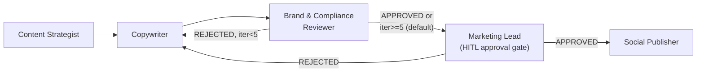
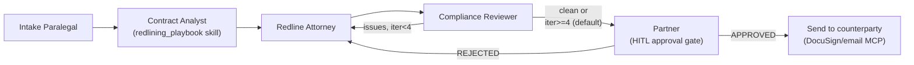
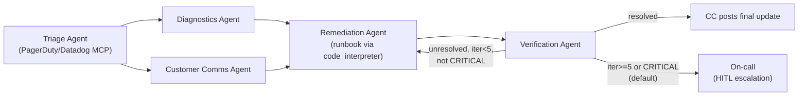

# Ravana — Additional Example Workflows

[ARCHITECTURE.md §4](ARCHITECTURE.md) has one worked example (the Software Development Team). These three prove the same engine — same schema, same primitives, zero new mechanisms — configures genuinely different domains, per the domain-agnostic claim in [§0](ARCHITECTURE.md). Each demonstrates a distinct use of HITL, since that turned out to be the primitive most likely to be mistaken for SWE-specific:

| Example | HITL pattern | What else it proves out |
|---|---|---|
| Marketing | **Approval gate** — human's decision *is* the outcome, not a clarification | Review loop identical in shape to Dev↔QA; Skills realizing §8's content-moderation-by-composition pattern |
| Legal | Approval gate (same pattern as Marketing) | A different loop pair (Attorney↔Compliance); the `redlining_playbook` Skill named as an example back in §1.6, now actually written |
| IT/Ops | **Escalation** — human takes over, doesn't answer back into the graph | Broadcast used for parallelism, not spec-fanout; HITL triggered by severity/iteration count, not ambiguity |

A note on the approval-gate pattern used in Marketing and Legal below, since it isn't the same shape as the PM clarification example in §4: the node's agent runs *twice* by design. First pass: `output_schema` doesn't require the verdict field, so the agent just prepares a human-readable summary and leaves the verdict unset — routing finds no match, `hitl_config.trigger_condition` (`verdict == null`) fires, and the run pauses. The human's response is then a new message in that node's thread, and per [§3.1's Resume step](ARCHITECTURE.md), the *same node* gets a fresh `node_execution` attempt — second pass, the agent now has the human's decision in context and transcribes it into the required verdict field. This is the same "agent re-runs with the human's answer" mechanic the PM example uses, just with the trigger condition being "no verdict yet" instead of "clarity is low."

---

## 1. Marketing — Campaign Content Pipeline



```yaml
apiVersion: ravana/v1
kind: Workflow
metadata:
  name: marketing-campaign-pipeline
  description: "Strategist -> Copywriter/Brand-Review loop -> Marketing Lead approval gate -> Publish"
  version: 1

spec:
  concurrency:
    group: "campaign:${input.campaign_id}"
    strategy: queue

  state:
    schema:
      campaign_request: { type: string,  merge: overwrite, pii: false }
      campaign_brief:   { type: object,  merge: overwrite }
      draft_copy:       { type: object,  merge: overwrite }
      review_status:    { type: string,  merge: overwrite }   # PENDING | APPROVED | REJECTED
      review_feedback:  { type: object,  merge: merge-object }
      lead_verdict:     { type: string,  merge: overwrite }   # unset until the Lead's second pass | APPROVED | REJECTED
      iteration_count:  { type: integer, merge: overwrite }
    initial:
      review_status: "PENDING"
      iteration_count: 0

  toolkits:
    - id: web_search
      type: web_search
      config: { provider: tavily }

    - id: social_mcp
      type: mcp_server
      config:
        transport: http
        url: https://mcp.buffer.com/sse
        allowed_tools: [schedule_post, list_channels]
      auth_ref: secrets://buffer_token   # top-level, not inside config — matches toolkit.auth_ref in ARCHITECTURE.md §2.2

  skills:
    - id: brand_voice_guide
      description: "House brand voice and tone for all external copy"
      instructions: |
        Confident, plain-language, no jargon, no superlatives ("best",
        "revolutionary"). Always speak to the customer's outcome, not
        the product's features.
    - id: compliance_checklist
      description: "Legal/compliance checks before copy can be published"
      instructions: |
        No unverifiable claims, no comparative claims against named
        competitors, required disclaimer present for any pricing/offer
        mentioned, no medical/financial advice framing.

  agents:
    - id: strategist
      name: "Content Strategist"
      llm: { provider: anthropic, model: claude-sonnet-5, temperature: 0.4 }
      system_prompt: |
        Turn a raw campaign request into a campaign_brief: target
        audience, key messages, channel, tone notes.
      toolkits: [web_search]

    - id: copywriter
      name: "Copywriter"
      llm: { provider: anthropic, model: claude-sonnet-5, temperature: 0.7 }
      system_prompt: |
        Draft copy per campaign_brief. If review_feedback or a REJECTED
        lead_verdict is present, revise to address it directly.
      skills: [brand_voice_guide]

    - id: reviewer
      name: "Brand & Compliance Reviewer"
      llm: { provider: openai, model: gpt-4o, temperature: 0.1 }
      system_prompt: |
        Check draft_copy against brand voice and the compliance
        checklist. Set review_status to APPROVED or REJECTED with
        specific, actionable feedback on failure.
      skills: [brand_voice_guide, compliance_checklist]
      output_schema:
        type: object
        required: [review_status]
        properties:
          review_status: { type: string, enum: [APPROVED, REJECTED] }
          review_feedback:
            type: object
            properties:
              issues: { type: array, items: { type: string } }

    - id: lead
      name: "Marketing Lead"
      llm: { provider: anthropic, model: claude-sonnet-5, temperature: 0.2 }
      system_prompt: |
        You gate publication. First pass (no human response in context
        yet): summarize draft_copy and the review trail for a human
        decision-maker; do not set lead_verdict. Second pass (a human
        response is now in your context): set lead_verdict to APPROVED
        or REJECTED matching their decision, with brief reasoning.
      output_schema:
        type: object
        properties:
          summary: { type: string }
          lead_verdict: { type: string, enum: [APPROVED, REJECTED] }
      hitl:
        enabled: true
        trigger_condition: "state.lead_verdict == null"
        prompt_template: "Approve for publish?\n\n{{summary}}"
        assignee: "role:operator"

    - id: publisher
      name: "Social Publisher"
      llm: { provider: openai, model: gpt-4o-mini, temperature: 0.0 }
      system_prompt: "Schedule the approved copy to the requested channel(s)."
      toolkits: [social_mcp]

  graph:
    entry: strategist_brief

    nodes:
      - id: strategist_brief
        agent: strategist
      - id: copywriter_draft
        agent: copywriter
        on_enter: "state.iteration_count += 1"
      - id: brand_review
        agent: reviewer
      - id: lead_approval
        agent: lead
      - id: publish
        agent: publisher

    edges:
      - from: strategist_brief
        to: [copywriter_draft]

      - from: copywriter_draft
        to: [brand_review]

      - from: brand_review
        to: [copywriter_draft]
        condition: "state.review_status == 'REJECTED' && state.iteration_count < 5"
        label: "revision loop"

      - from: brand_review
        to: [lead_approval]
        condition: "state.review_status == 'APPROVED'"

      - from: brand_review
        to: [lead_approval]
        is_default: true   # REJECTED but iteration_count >= 5: let a human see it rather than dead-end

      - from: lead_approval
        to: [publish]
        condition: "state.lead_verdict == 'APPROVED'"

      - from: lead_approval
        to: [copywriter_draft]
        condition: "state.lead_verdict == 'REJECTED'"

      - from: publish
        to: [__terminal__]

    guards:
      max_total_steps: 40
      max_loop_iterations: { brand_review_to_copywriter_draft: 5 }
      max_tool_calls_per_turn: 6
      max_output_repairs: 2
      max_retries_per_node: 3
      max_tokens_total: 800000

  definition_of_done:
    evaluated_by: lead
    criteria:
      - "Copy matches brand_voice_guide and passes compliance_checklist"
      - "state.lead_verdict == 'APPROVED'"
```

---

## 2. Legal — Contract Redlining Pipeline



```yaml
apiVersion: ravana/v1
kind: Workflow
metadata:
  name: legal-contract-redlining
  description: "Intake -> Risk analysis -> Redline/Compliance loop -> Partner approval gate -> Send"
  version: 1

spec:
  concurrency:
    group: "contract:${input.contract_id}"
    strategy: queue

  state:
    schema:
      contract_text:      { type: string,  merge: overwrite, pii: true }   # may name individuals/counterparties
      contract_type:      { type: string,  merge: overwrite }
      risk_flags:         { type: array,   merge: overwrite }
      redline_draft:       { type: object,  merge: overwrite }
      compliance_status:  { type: string,  merge: overwrite }   # PASS | FAIL
      compliance_feedback: { type: object,  merge: merge-object }
      partner_verdict:    { type: string,  merge: overwrite }   # unset until second pass | APPROVED | REJECTED
      iteration_count:    { type: integer, merge: overwrite }
    initial:
      compliance_status: "PENDING"
      iteration_count: 0

  toolkits:
    - id: docusign_mcp
      type: mcp_server
      config:
        transport: http
        url: https://mcp.docusign.example/sse
        allowed_tools: [send_for_signature]
      auth_ref: secrets://docusign_token

  skills:
    - id: redlining_playbook
      description: "Org standard fallback positions on liability, IP, termination clauses"
      instructions: |
        Liability cap: never accept uncapped liability; counter at 12
        months' fees. IP: all work product assigned to us on payment.
        Termination: mutual 30-day notice, no unilateral for-convenience
        clause in our favor only.

  agents:
    - id: paralegal
      name: "Intake Paralegal"
      llm: { provider: anthropic, model: claude-sonnet-5, temperature: 0.1 }
      system_prompt: "Extract key terms from contract_text and classify contract_type."

    - id: analyst
      name: "Contract Analyst"
      llm: { provider: anthropic, model: claude-sonnet-5, temperature: 0.1 }
      system_prompt: "Flag clauses in contract_text that deviate from redlining_playbook into risk_flags."
      skills: [redlining_playbook]

    - id: attorney
      name: "Redline Attorney"
      llm: { provider: anthropic, model: claude-sonnet-5, temperature: 0.2 }
      system_prompt: |
        Draft redline_draft addressing risk_flags per redlining_playbook.
        If compliance_feedback is present, revise to address it.
      skills: [redlining_playbook]

    - id: compliance
      name: "Compliance Reviewer"
      llm: { provider: openai, model: gpt-4o, temperature: 0.1 }
      system_prompt: "Check redline_draft against compliance requirements. Set compliance_status PASS or FAIL with feedback."
      output_schema:
        type: object
        required: [compliance_status]
        properties:
          compliance_status: { type: string, enum: [PASS, FAIL] }
          compliance_feedback: { type: object }

    - id: partner
      name: "Partner"
      llm: { provider: anthropic, model: claude-sonnet-5, temperature: 0.1 }
      system_prompt: |
        First pass: summarize redline_draft and residual risk_flags for
        partner sign-off; do not set partner_verdict. Second pass (human
        response in context): set partner_verdict to APPROVED or
        REJECTED matching their decision.
      output_schema:
        type: object
        properties:
          summary: { type: string }
          partner_verdict: { type: string, enum: [APPROVED, REJECTED] }
      hitl:
        enabled: true
        trigger_condition: "state.partner_verdict == null"
        prompt_template: "Sign off on redlines?\n\n{{summary}}"
        assignee: "role:operator"

    - id: sender
      name: "Sender"
      llm: { provider: openai, model: gpt-4o-mini, temperature: 0.0 }
      system_prompt: "Send the approved redlines to the counterparty for signature."
      toolkits: [docusign_mcp]

  graph:
    entry: intake

    nodes:
      - id: intake
        agent: paralegal
      - id: risk_analysis
        agent: analyst
      - id: redline_draft
        agent: attorney
        on_enter: "state.iteration_count += 1"
      - id: compliance_review
        agent: compliance
      - id: partner_approval
        agent: partner
      - id: send
        agent: sender

    edges:
      - from: intake
        to: [risk_analysis]
      - from: risk_analysis
        to: [redline_draft]
      - from: redline_draft
        to: [compliance_review]

      - from: compliance_review
        to: [redline_draft]
        condition: "state.compliance_status == 'FAIL' && state.iteration_count < 4"
        label: "redline loop"

      - from: compliance_review
        to: [partner_approval]
        condition: "state.compliance_status == 'PASS'"

      - from: compliance_review
        to: [partner_approval]
        is_default: true   # FAIL but iteration_count >= 4: escalate to partner rather than dead-end

      - from: partner_approval
        to: [send]
        condition: "state.partner_verdict == 'APPROVED'"

      - from: partner_approval
        to: [redline_draft]
        condition: "state.partner_verdict == 'REJECTED'"

      - from: send
        to: [__terminal__]

    guards:
      max_total_steps: 40
      max_loop_iterations: { compliance_review_to_redline_draft: 4 }
      max_tool_calls_per_turn: 6
      max_output_repairs: 2
      max_retries_per_node: 3
      max_tokens_total: 1000000

  definition_of_done:
    evaluated_by: partner
    criteria:
      - "All risk_flags addressed or explicitly accepted by the partner"
      - "state.partner_verdict == 'APPROVED'"
```

---

## 3. IT/Ops — Incident Triage & Auto-Remediation



```yaml
apiVersion: ravana/v1
kind: Workflow
metadata:
  name: incident-triage-remediation
  description: "Triage -> broadcast [Diagnostics, Comms] -> Remediation/Verification loop -> resolve or escalate"
  version: 1

spec:
  concurrency:
    group: "incident:${input.incident_id}"
    strategy: allow   # distinct incidents never collide; no shared external target to protect

  state:
    schema:
      alert_payload:    { type: object,  merge: overwrite }
      severity:         { type: string,  merge: overwrite }   # LOW | MEDIUM | HIGH | CRITICAL
      diagnostics:      { type: object,  merge: overwrite }
      customer_update:  { type: string,  merge: overwrite }
      remediation_log:  { type: array,   merge: append }       # multiple remediation attempts append here
      resolved:         { type: boolean, merge: overwrite }
      iteration_count:  { type: integer, merge: overwrite }
    initial:
      resolved: false
      iteration_count: 0

  toolkits:
    - id: pagerduty_mcp
      type: mcp_server
      config:
        transport: http
        url: https://mcp.pagerduty.example/sse
        allowed_tools: [get_alert, page_oncall]
      auth_ref: secrets://pagerduty_token

    - id: runbook_interpreter
      type: code_interpreter
      config: { runtime: python3.11, sandbox: docker }

  agents:
    - id: triage
      name: "Triage Agent"
      llm: { provider: anthropic, model: claude-sonnet-5, temperature: 0.1 }
      system_prompt: "Classify severity from alert_payload using PagerDuty/Datadog context."
      toolkits: [pagerduty_mcp]
      output_schema:
        type: object
        required: [severity]
        properties:
          severity: { type: string, enum: [LOW, MEDIUM, HIGH, CRITICAL] }

    - id: diagnostics
      name: "Diagnostics Agent"
      llm: { provider: anthropic, model: claude-sonnet-5, temperature: 0.1 }
      system_prompt: "Gather logs/metrics relevant to alert_payload into diagnostics."
      toolkits: [pagerduty_mcp]

    - id: comms
      name: "Customer Comms Agent"
      llm: { provider: openai, model: gpt-4o-mini, temperature: 0.3 }
      system_prompt: "Draft a customer-facing status update into customer_update."

    - id: remediation
      name: "Remediation Agent"
      llm: { provider: anthropic, model: claude-sonnet-5, temperature: 0.1 }
      system_prompt: "Propose and execute a fix per diagnostics using an approved runbook. Append the attempt to remediation_log."
      toolkits: [runbook_interpreter]

    - id: verification
      name: "Verification Agent"
      llm: { provider: anthropic, model: claude-sonnet-5, temperature: 0.0 }
      system_prompt: "Check whether the incident is resolved. Set resolved accordingly."
      toolkits: [pagerduty_mcp]
      output_schema:
        type: object
        required: [resolved]
        properties: { resolved: { type: boolean } }
      hitl:
        enabled: true
        trigger_condition: "state.severity == 'CRITICAL' || state.iteration_count >= 5"
        prompt_template: "Escalating incident {{alert_payload.id}}: {{iteration_count}} remediation attempts, severity {{severity}}."
        assignee: "role:operator"   # pages whoever is on-call, per §3.1's assignee resolution

  graph:
    entry: triage_intake

    nodes:
      - id: triage_intake
        agent: triage
      - id: diagnostics_gather
        agent: diagnostics
      - id: comms_draft
        agent: comms
      - id: remediate
        agent: remediation
        on_enter: "state.iteration_count += 1"
      - id: verify
        agent: verification

    edges:
      - from: triage_intake
        to: [diagnostics_gather, comms_draft]
        mode: broadcast   # parallel for speed, not for spec-fanout — a different reason than §4's SA broadcast

      - from: diagnostics_gather
        to: [remediate]
      - from: comms_draft
        to: [remediate]

      - from: remediate
        to: [verify]

      - from: verify
        to: [remediate]
        condition: "!state.resolved && state.iteration_count < 5 && state.severity != 'CRITICAL'"
        label: "retry remediation"

      - from: verify
        to: [comms_draft]
        condition: "state.resolved"

      - from: verify
        to: [__terminal__]
        is_default: true   # unresolved, iter>=5 or CRITICAL: HITL fires below before this would ever be reached with zero routes

    guards:
      max_total_steps: 30
      max_loop_iterations: { verify_to_remediate: 5 }
      max_tool_calls_per_turn: 8
      max_output_repairs: 2
      max_retries_per_node: 3
      max_tokens_total: 600000

  definition_of_done:
    evaluated_by: verification
    criteria:
      - "state.resolved == true, or an on-call human has taken ownership via HITL"
```

**Why `verify`'s escalation edge is `is_default` instead of a `condition`:** the HITL check ([§3.1](ARCHITECTURE.md)) runs *before* a default edge is considered — so when severity is `CRITICAL` or the loop budget is exhausted, HITL fires first and pages on-call; the run only reaches the default `__terminal__` edge in the (essentially unreachable here) case where HITL is somehow disabled. This is the "escalation" HITL pattern: the human doesn't answer back into the graph the way Marketing's/Legal's approval gates do — paging on-call *is* the terminal action for Ravana's part of this workflow, the human takes it from there outside the system.
